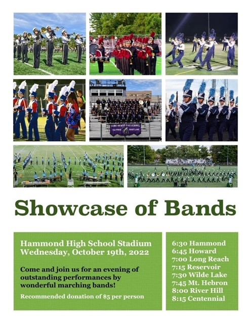

# Accessibility


## What is Web Accessibility?

From the [The World Wide Web Consortium](https://www.w3.org/WAI/fundamentals/accessibility-intro/#what):

Web accessibility means that websites, tools, and technologies are designed and
developed so that people with disabilities can use them. More specifically,
people can:

- perceive, understand, navigate, and interact with the Web
- contribute to the Web

Web accessibility encompasses all disabilities that affect access to the Web,
including:

- auditory
- cognitive
- neurological
- physical
- speech
- visual

!!! success "Web accessibility also benefits people without disabilities, for example:"

    - people using mobile phones, smart watches, smart TVs, and other devices with
    small screens, different input modes, etc.
    - older people with changing abilities due to ageing
    - people with “temporary disabilities” such as a broken arm or lost glasses
    - people with “situational limitations” such as in bright sunlight or in an
    environment where they cannot listen to audio
    - people using a slow Internet connection, or who have limited or expensive
    bandwidth

## What is Assistive Technology?

 Assistive technology is software and hardware that people with disabilities use
 to improve interaction with the web. These include:

  - **screen readers** that read aloud web pages for people who cannot read the
    text
  - **screen magnifiers** for people with some types of low vision
  - **special color modes** for people with color blindness or other vision
    impairments
  - **speech recognition** software and selection switches for people who cannot
    use a keyboard or mouse.
  - **Head pointers** A stick or object mounted directly on the user’s head that
    can be used to push keys on the keyboard. This device is used by individuals
    who have no use of their hands.
  - **Motion tracking or eye tracking**: This can include devices that watch a
    target or even the eyes of the user to interpret where the user wants to
    place the mouse pointer and moves it for the user.
  - **Refreshable Braille Displays** use mechanical pins to display braille
    characters that a user reads with their fingers.

## What is Our Responsibility?

HCPSS is **required by law** to make our web content accessibly to people with
disabilities.

## What Can We do to Make Our Content Accessible?

There are many disabilies and many assistive technologies. Luckily, we can make
our content accessible to most of them by following some general guidelines:

- Provide text alternatives for non-text content.
- Make all functionality available from a keyboard.
- Provide captions and other alternatives for multimedia.
- Make it easier for users to see and hear content.

## The Importance of Structure

Many assistive technologies, like screen readers, analyze on a web page's
**text** and **structure** to allow the user to navigate through the content.
[This video is a great introcution to the use of screen readers](https://www.youtube.com/watch?v=7Rs3YpsnfoI).

  - **Headings**: [ensure your headings are noted in a clear hierarchical order](using-the-rich-text-editor.md#heading-level),
    built up of one h1 (the page title), multiple h2’s which are used to outline
    the main sections, with h3 and other headings used to display sub-sections
    within a main topic.
  - **Links**: one way a screen reader navigates a site is by skipping though
    all the links. So make sure your links have meaningfull text. Avoid "click
    here" or "read more". Instead use phrases like "Read the principal's
    letter" or "Policy 90200".
  - **Lists**: [Make sure your lists are ligitmate](using-the-rich-text-editor.md#make-sure-your-lists-are-legitamate).
    Just because it looks like a numbered list doesn't mean it is.

!!! warning "Images cannot contain structure"

    Notice that images are not on the list. It's important to add alternative
    text to images, but this does not provide any structure. This is why **it
    is not acceptable to use images that contain more than a few words**.

## What is The Role of a Web Manager?

The HCPSS Multimedia Communications team has build the school websites with
accessibility in mind. The only time a Web Manager has the ability to affect
accessibility is when using the [Rich Text Editor](using-the-rich-text-editor.md).

### Only Use Images When Neccessary

Images slow down a website affecting users with limited interned connection.
They also can pose a challenge for mobile devices. So use them sparingly.

### Provide Alternative Text for Images

When you use images, make sure to [provide meaningful alternative text](adding-and-managing-media.md#new-images).

Never post images that contain alot of text. If an image contains text, you must
put all the text into the alternative text, but you will not be able to provide
any structure. For example:



This image contains critical information that all users need. It has a heading
"Showcase of Bands" and a list of times and locations, but a screen reader can't
parse the strucure and will just read it as one long string:

```
Showcase of Bands Hammond High School Stadium Wednesday, October 19th, 2022 Come
and join us for an evening of outstanding performances by wonderful marching
bands! Recommended donation of $5 per person 6:30 Hammond 6:45 Howard 7:00 Long
Reach 7:15 Reservoir 7:30 Wilde Lake 7:45 Mt. Hebron 8:00 River Hill 8:15
Centennial
```

This content needs to be entered directly into the Rich Content Eitor. Then it
can have a structure like this:

```
Header:     Showcase of Bands
Paragraph:  Hammond High School Stadium
            Wednesday, October 19th, 2022
Paragraph:  Come and join us for an evening of outstanding performances by
            wonderful marching bands!
Paragraph:  Recommended donation of $5 per person
List items: 6:30 Hammond
            6:45 Howard
            7:00 Long Reach
            7:15 Reservoir
            7:30 Wilde Lake
            7:45 Mt. Hebron
            8:00 River Hill
            8:15 Centennial
```

Now the screen reader and present the user with a much richer version of the
content.

### Only Post Documents When Necessary

Unlike with images, there is no opportunity to add alternative text to a
document. The assistive technology will be left to try to read the document.

!!! danger "You should almost never post documents"

    I struggle to think of a scenario where it would be acceptable to post a
    document. It is always a better idea to take the content out of the document
    and put it in the Rich Text Editor

## Can Microsoft Word, Google Doc, and Adobe Acrobat Files be Accessibly?

Yes, but they require special expertise and tools. The HCPSS Multimedia
Communications department has the tools and expertise to make Acrobat (PDF)
files accessible, but no other formats.
