---
tags:
  - updated
---
# Adding and Managing Media

This video covers adding and managing media. The same material is covered below.

<video style="width: 100%" loop="" muted="" controls="" alt="type:video">
    <source src="../videos/adding-and-managing-media.mp4" type="video/mp4">
    <track label="English" kind="subtitles" srclang="en" src="../captions/vtt/adding-and-managing-media.vtt" default>
</video>

## Adding Media using the Rich Text Editor

Media (images and documents) can be included anywhere the Rich Text Editor is
used. This includes News and Events as well as other content.

You should be familiar with the Rich Text Editor before adding media. See the
[Using the Rich Text Editor](using-the-rich-text-editor.md) for more info.

### Images

Click on the *Insert Media* button in the Rich Text Editor toolbar.

This will open the *Media Browser*. There are tabs for images and documents.
Make sure *Images* is active.

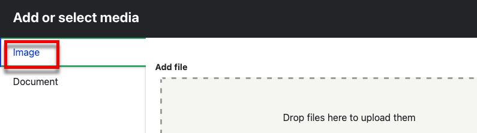

#### Existing Images

To add an existing image, scroll down to the thumbnails.

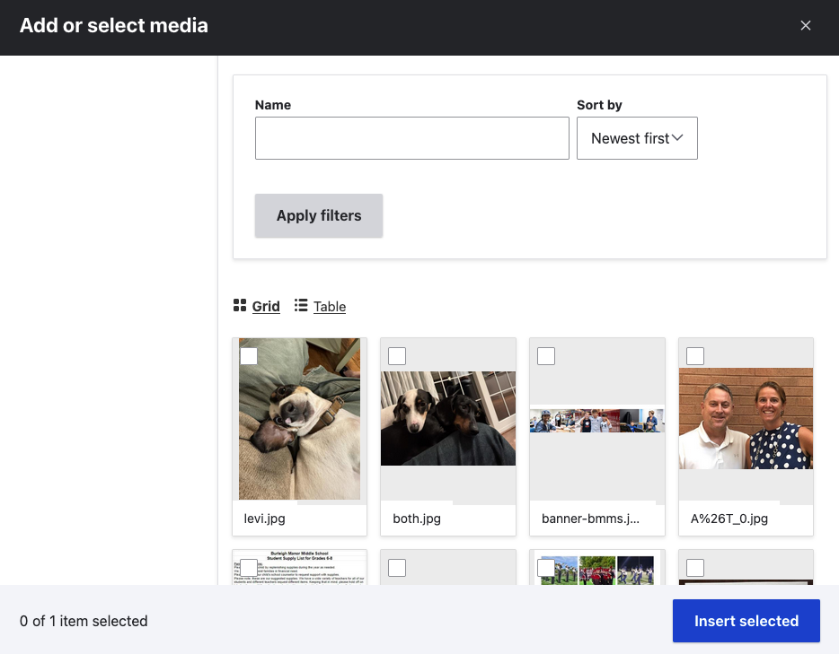

Here, you can filter by file name and change the layour between grid and table.

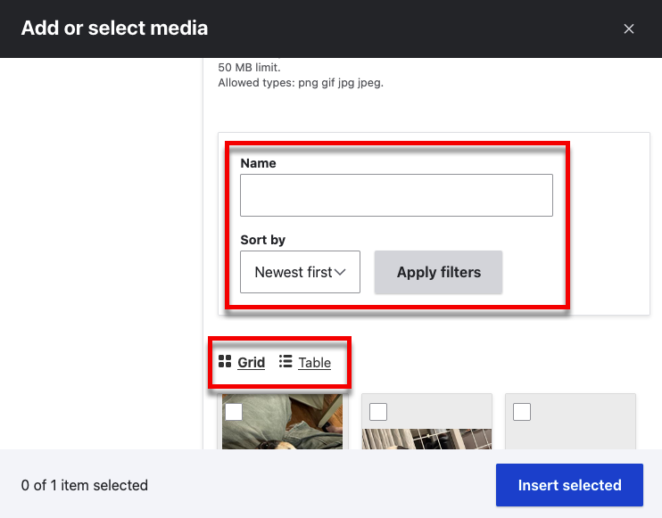

When you find the image you want, click on it and click *Insert selected*.

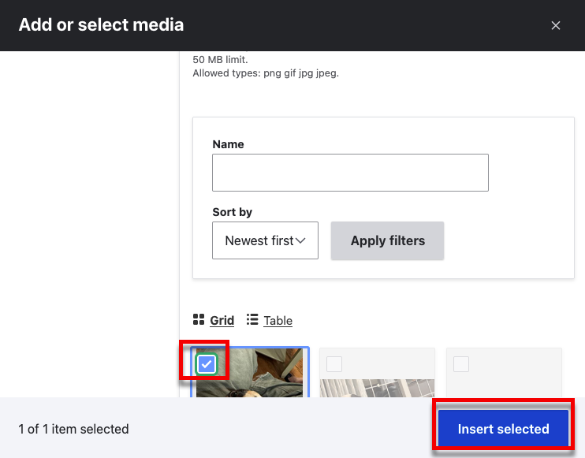

#### New Images

To add a new image, click *Select files* or drag files into the *Add file*
section.

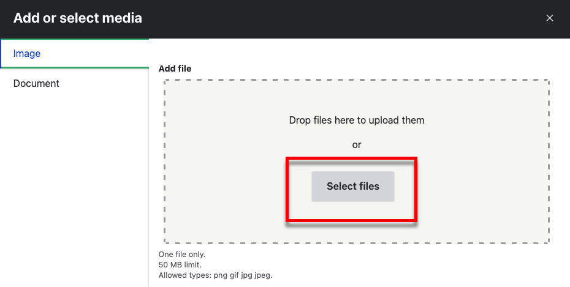

Select your image (make sure it is a gif, png, jpg or jpeg).

Then, make sure to add alternative text.

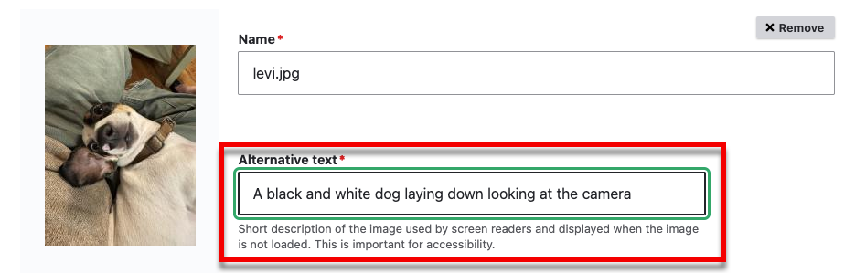

!!! accessibility

    Your alternative text should describe the image.

Then click *Save*.

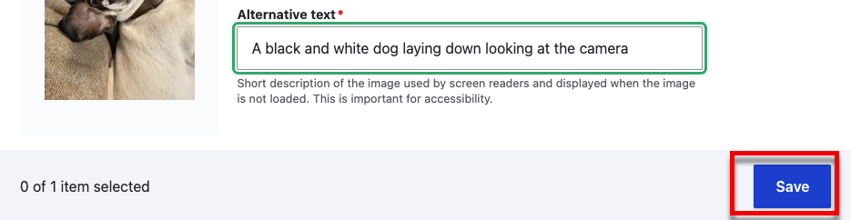

Now your image is added to your media library and automaically selected. Click
*Insert Selected*.

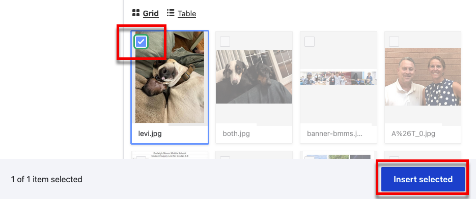

You should now see the image in the Rich Text Editor.

#### Image Options

When you click on the image in the Rich Text Editor, you should see a toolbar
below it.

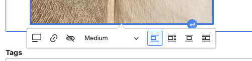

##### Caption

Use the button labeled *Toggle caption on* to add a caption.

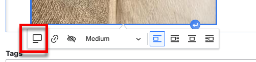

Then type the caption below the image.

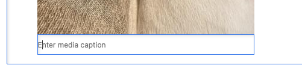

##### Link

You can link the image to a webpage with the *Link* button.

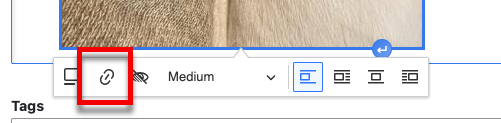

Enter the url (it should start with "https://") and click on the green
checkmark.

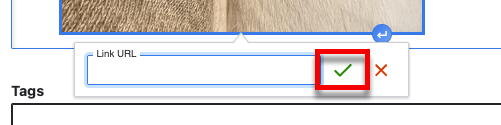

##### Override Alternative Text

Images in the media library have alternative text associated with them. You
can override the default by clicking on the *Override Alternative Text* button.

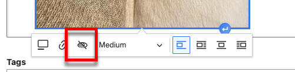

Then enter the text and make sure you click on the green checkmark.

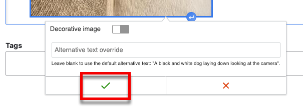

##### View Mode

Use the view mode select list to change the size of the image. You can choose
thumbnail, medium, or large.

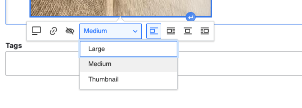

##### Alignment

The alignment buttons allow you to align left or center and allow you to control
how text wraps around the image.

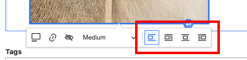

### Documents

Click on the *Insert Media* button in the Rich Text Editor toolbar.

This will open the *Media Browser*. There are tabs for images and documents.
Make sure *Documents* is active.

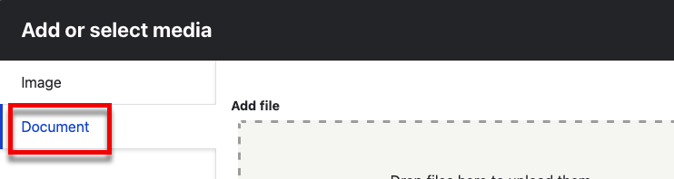

#### Existing Documents

To add an existing document, scroll down to the thumbnails.

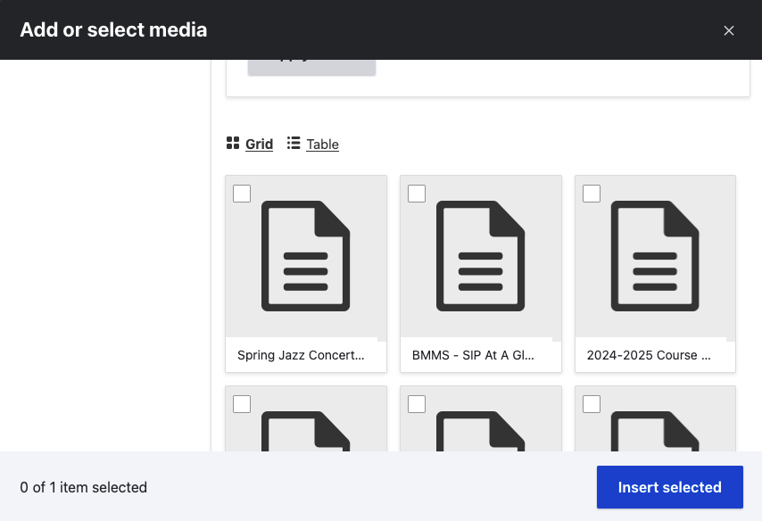

Here, you can filter by file name and change the layour between grid and table.

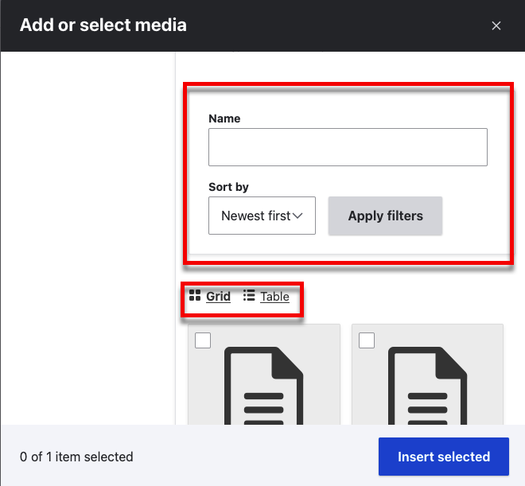

When you find the document you want, click on it and click *Insert selected*.

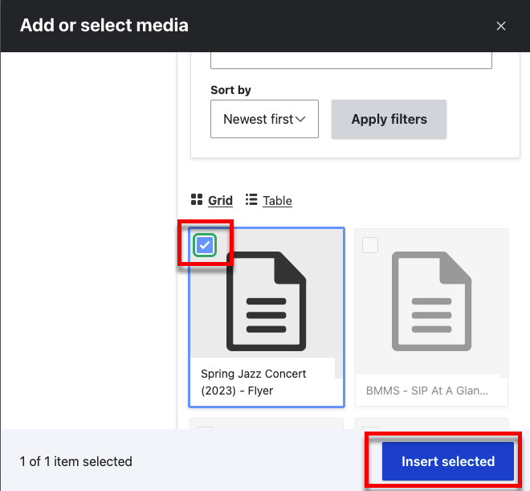

#### New Documents

To add a new image, click *Select files* or drag files into the *Add file*
section.

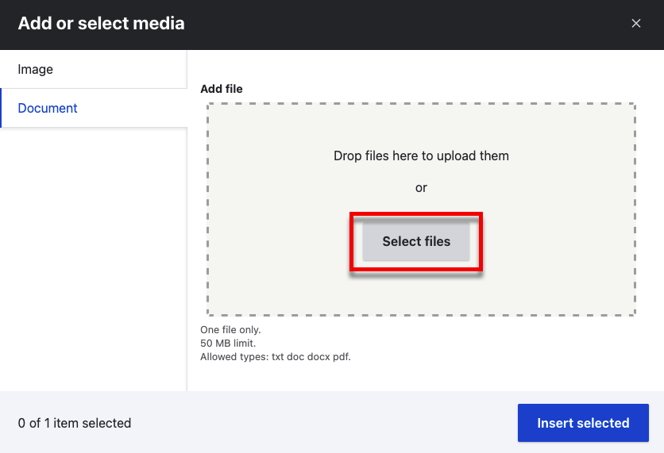

Select your document (make sure it is a pdf, doc, or docx).

Then, make sure to give the document a name.

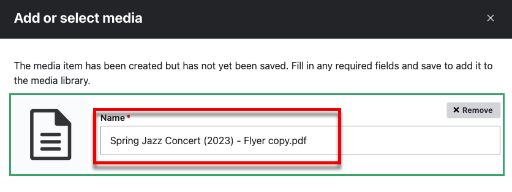

!!! tip

    The document name will default to the file name. It's a good idea to give
    the document a more human readable name because this name is what users will
    see.

Then click *Save*.

Now your document is added to your media library and automaically selected. Click
*Insert Selected*.

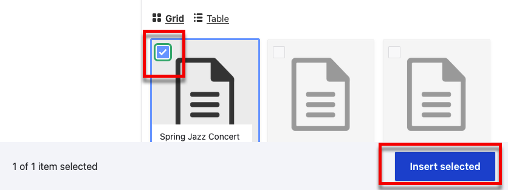

You should now see the document in the Rich Text Editor.
