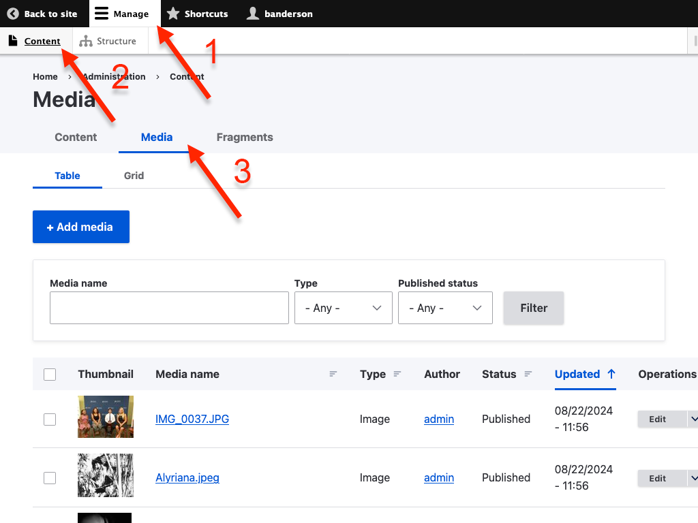
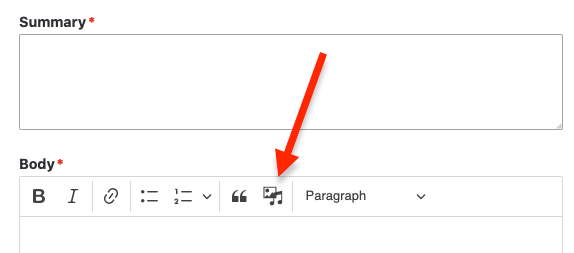

# Adding and Managing Media

## Media Library

Images and documents are stored in your Media library. You can access your media
library by going to *Manage > Content > Media*

Here you can add and find media.

## Adding Media to Content

Images and documents can be added to news items and events by clicking the 
*Insert Media* button.

Then you can select existing media or upload new media.

