# Advanced Pages

Advanced pages are pages that are made up of other pieces of content.

Some pages on your website that are advanced pages might be:

- Home
- About
- Our Staff
- Student Services

Web Managers cannot create advanced pages, and some are locked and cannot be 
edited, but others can be edited.

Advanced pages only contain a title and one other field called 
**Content Blocks**. Here you can add content from elsewhere on the site or other
structured content. You can have as many as you want.

To add a content block select the type from the select list.

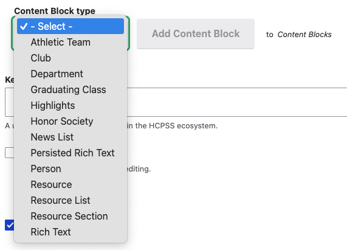

Then click *Add content block*.

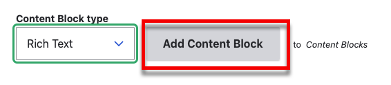

## Content Block Types

Depending on the configuration of your school website, you may not have all 
content block types available. If you have questions about this contact 
[webmaster@hcpss.org](mailto:webmaster@hcpss.org)

### Athletic Teams, Clubs, Graduating Classes, Honor Societies, and Resource Lists

Adding Athletic Teams, Clubs, Graduating Classes, Honor Societies, 
and Resource List are all very similar. You will be presented with a Select 
button.

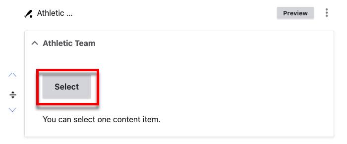

You will be presented with a page where you can find existing or create new 
items.

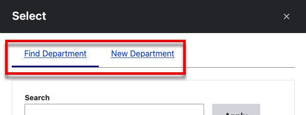

#### Find an Existing Item

You can search for your item. Then select it and click *Select*.

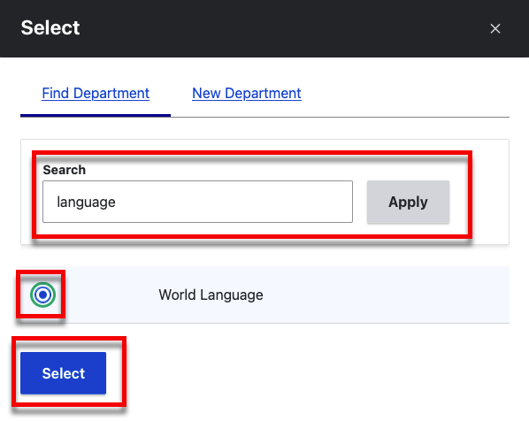

#### Create a new Item

To create a new item, fill out the form and click *Save*.

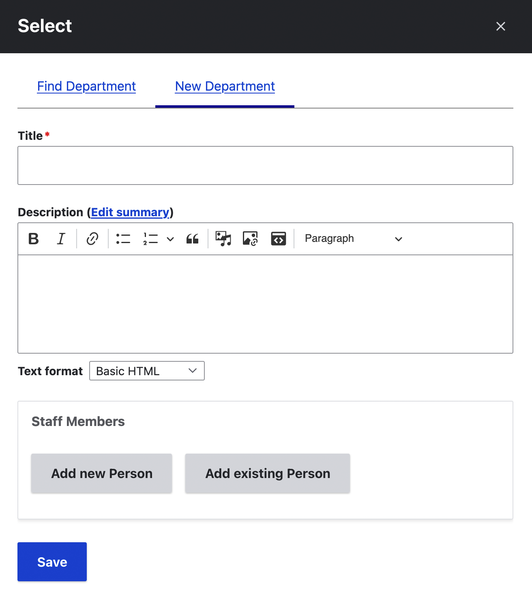

This will add a blank content block. In the new block click
*Select*.

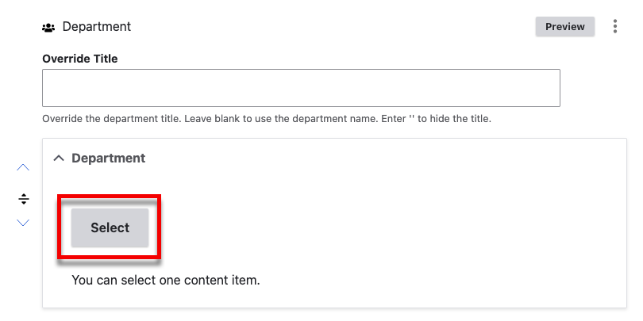

Here you can add an existing or new item.

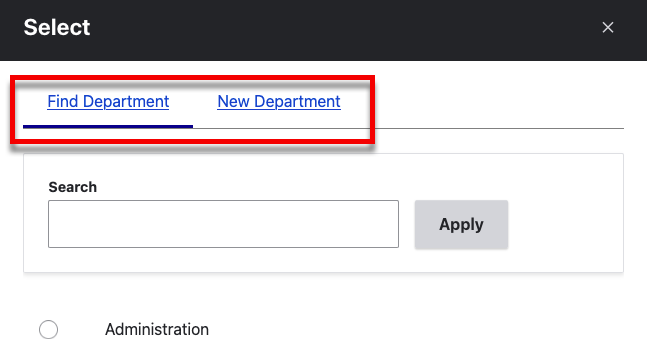

### Departments

#### New Department

Fill out the form to add a department. Make sure to give it a title. You can
add new or existing people.

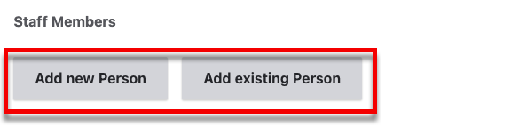

Use the autocomplete field to add find existing people.

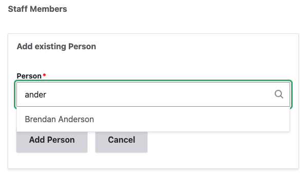

When you are done, click *Save*.

#### Existing Department

Use the search box to search for a department. Then click the radio button next
to the department and click *Select*.

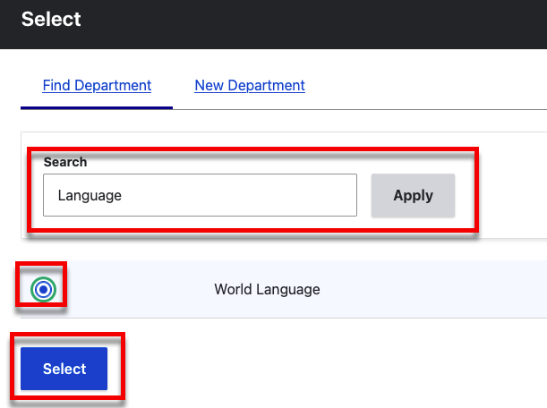

#### The Department Content Block

Whether you create a new, or add an existig, department you should now see it in
the new department content block.

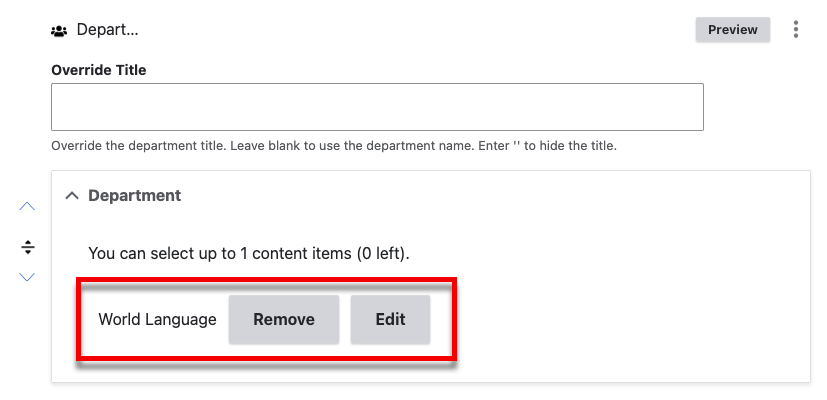

##### Overriding the Title

You can override the department title.

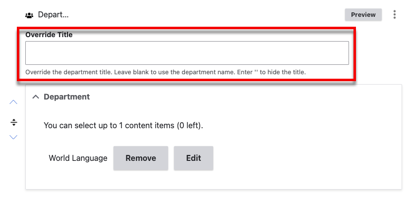

When you use this field, the title of the department will remain the same, but
it will be overridden on the current page.

!!! question "Why Would You Want to Override the Department Title"

    On the staff page, you probably wouldn't, but departments can be added to
    other pages too. So imagine a *World Language* page where you want to list
    the world language staff. You already have a *World Language* department,
    but you probably don't want the department to be labeled "World Language"
    because users are already on the *World Language* page.

    In this case, you might want to everride the title with something like
    "Staff" or "Support Staff".

### News List

A *News List* is a list of news items that have a specific tag. For example,
let's say you have a few news items tagged with "Student Services" and you would
like to show them on the Student Services page.

Add the News List content block and enter that tag you want to display.

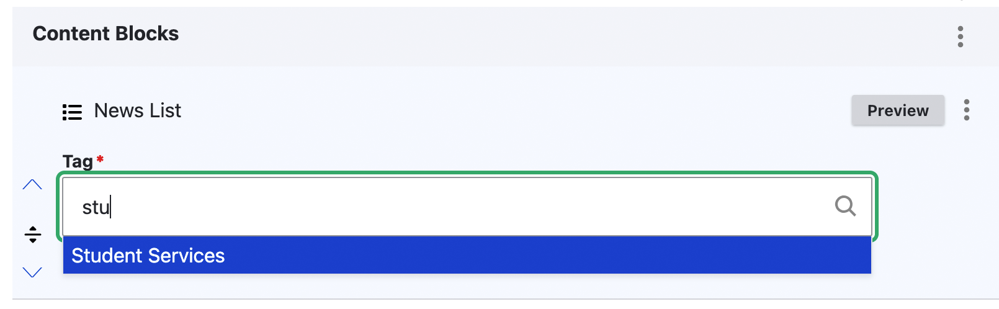

You can preview what the news list will look like by clicking *Preview*.

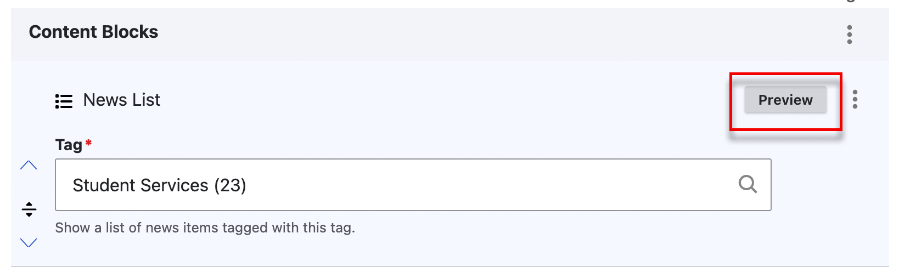

When you save the page, the News List will display as a list of news items 
tagged with "Student Services" (or whatever you would like) sorted by the 
creation date, newest first.

### Person

The *Person* content block is for displaying a single person (usually a staff
member).

Similar to *Athletic Teams, Clubs, Departments, Graduating Classes, Honor 
Societies*, you will be presented with a *Select* button.

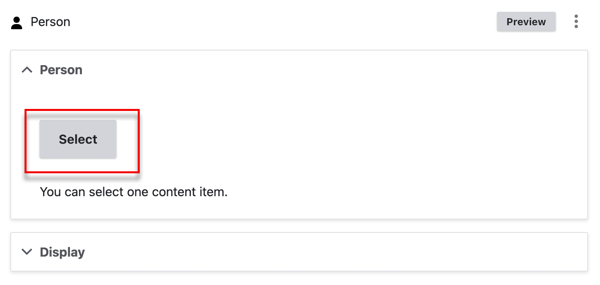

And after pressing it you can select an existing, or create a new *Person*.

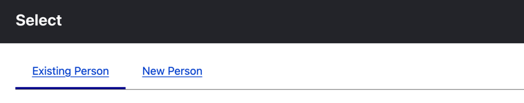

After selecting the Person, take a look at the *Display* section at the bottom.

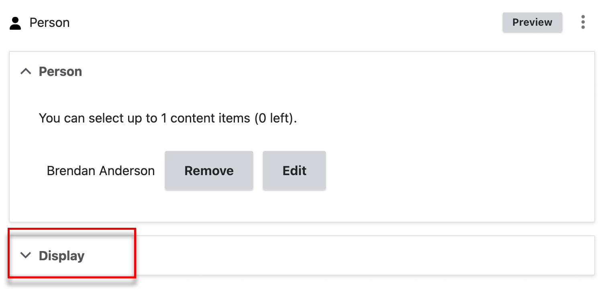

Here you can control how the person will be displayed:

- Compact: Single Line
- Medium: Name as heading and other details on one line.
- Full: Full photo and bio.

You can preview what the block will look like with the *Preview* button.

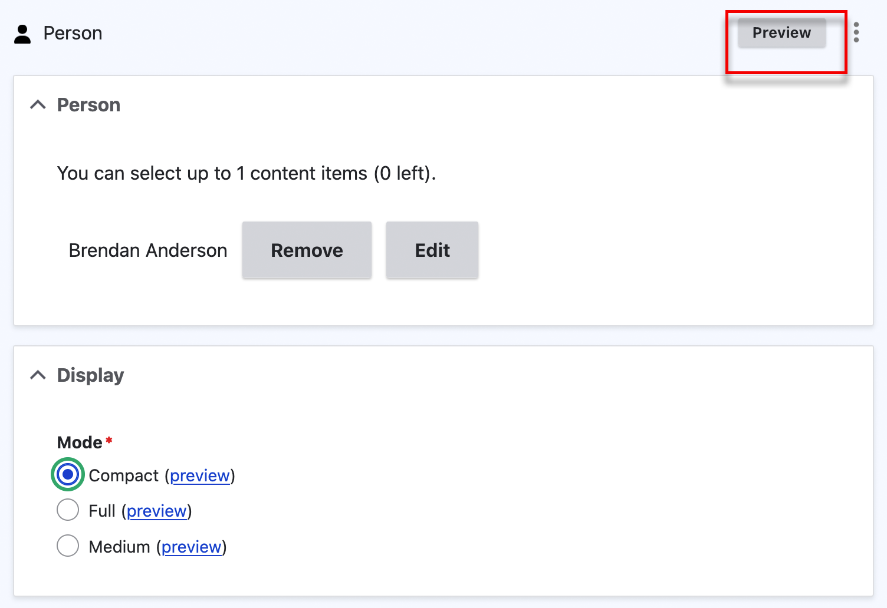

When you save the page, you will see the person block on your page.

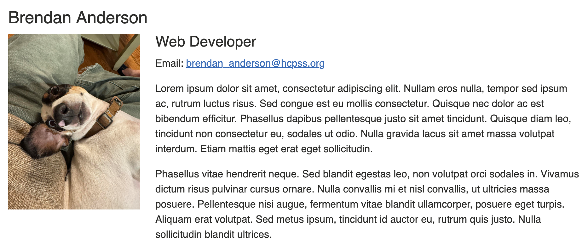

### Resource

A resource is a link but better because it is saved in your site. The benefit of
this is that you can use it on multiple pages and if the URL changes, you only
need to updated it once and it will be updated across all your pages.

[See the Resources page for more information about Resources.](resources.md)

When you add a Resource content block, you will be presented with buttons to 
find an existing Resource or create a new one.

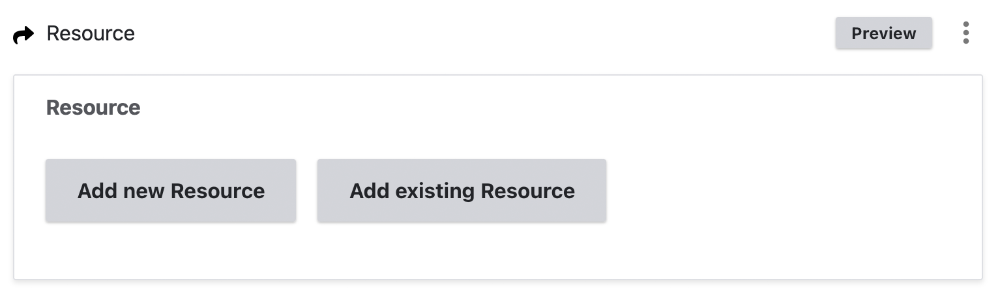

This is a little different from previous content blocks. When you click *Add
existing resource* you will be presented with an autocomplete field.

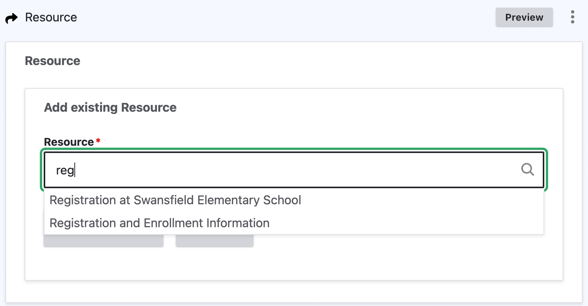

*Add new resource* will present you with the form to add a resource.

### Rich Text

The *Rich Text* content block simply gives you a Rich Text Editor so you can
add text, links, images or anything else you want.

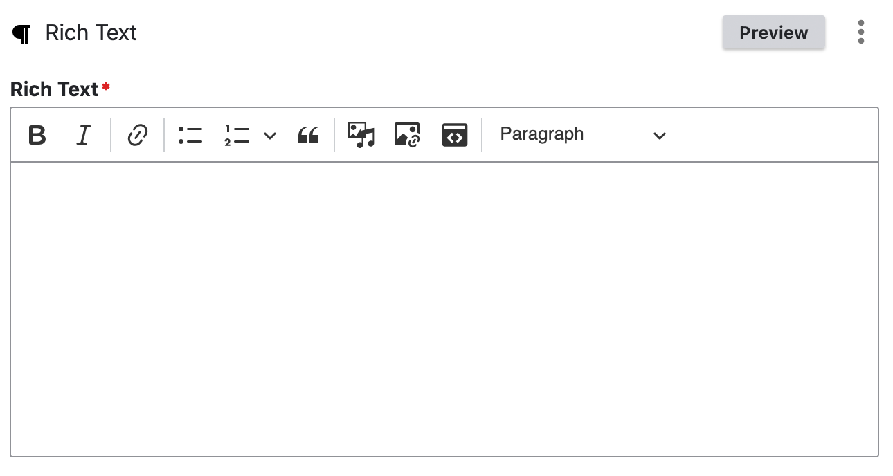

For more information about Rich Content Editor [see the Rich Content Editor 
page](using-the-rich-text-editor.md)

## Reordering Content Blocks

### Arrow Buttons

Beside each content block, there are up and down arrows that can be used to move
the block up and down one position.

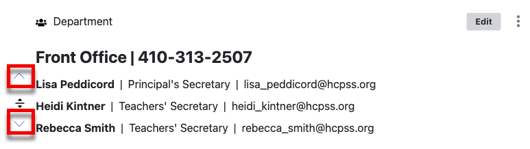

### Drag and Drop

Beside each content block there is an icon that you can use to drag the block
up or down in order.

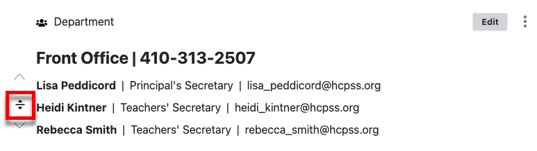

Because these blocks often take up much of the screen space, dragging and
dropping then can be challenging. The next technique addresses this.

### Using the Drag and Drop Overview

At the top of the *Content Blocks* section, there are 3 dots. Click on those and
then *Drag and drop overview*.

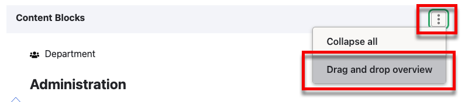

This colapses the blocks to a smaller size making it easier to drag and drop
them.

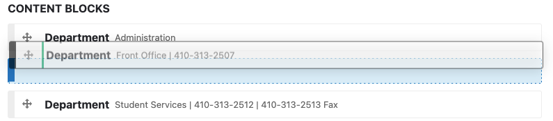

**Make sure you click *Complete drag & drop*** when you are done.

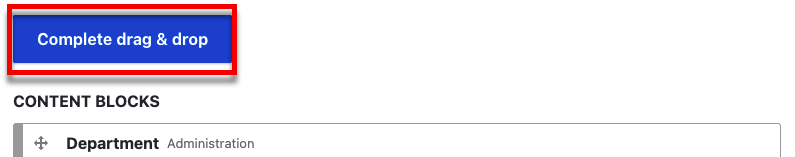

## Removing Content Blocks

On the right side of each content block there is a button with three dots. Click
that and then click *Remove*.

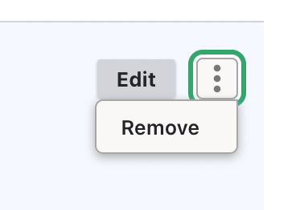
