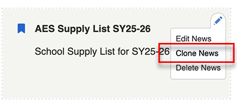
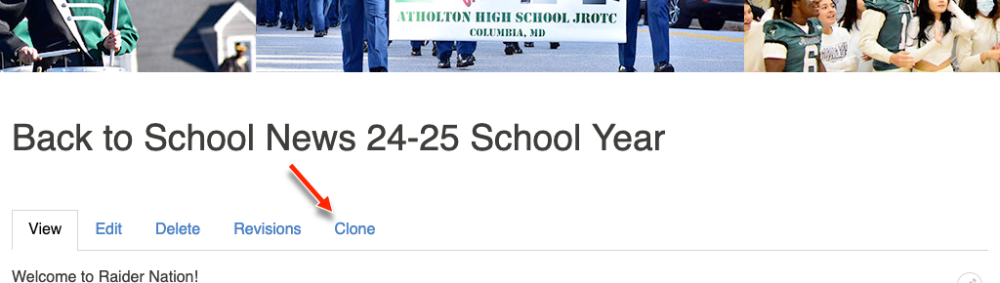
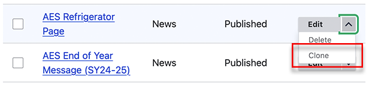
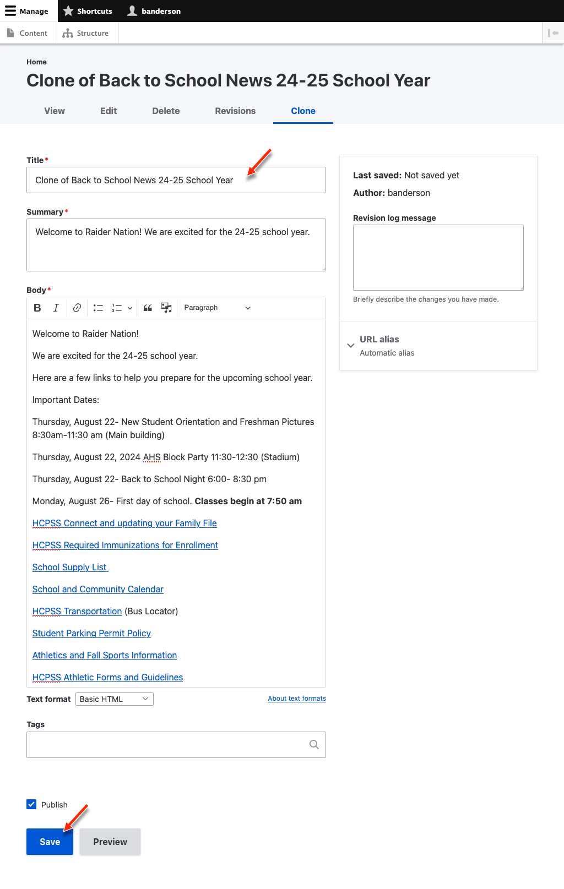

---
tags:
  - new
---
# Clone Content

You can easily create new content based on old content using the new *Clone*
feature. You can clone content from the:

## Context Menu

## Content Tabs

## Content Operations

## Fill out the Form

Once you have cloned the content **make sure to change the title** and anything
else you would like to update. Then click *Save*.

