---
tags:
  - updated
---
# Creating and Editing Events

!!! note
    The following instructions are only relevant to Drupal (non-Google)
    calendars. Creating events in Google calendars is a different process.

This video covers adding and editing events. The same material is covered below.

<video style="width: 100%" loop="" muted="" controls="" alt="type:video">
    <source src="../videos/creating-and-editing-events.mp4" type="video/mp4">
    <track label="English" kind="subtitles" srclang="en" src="../captions/vtt/creating-and-editing-events.vtt" default>
</video>

## Create Event From the Dashboard

The first is by going to dashboard and going to your events block and clicking
Add.

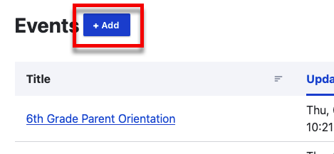

## Create Event From the Calendar

The second is by going to your calendar. And at the top clicking Add an Event.

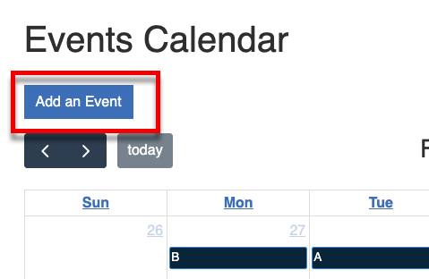

## Filling out the Form

1. Title
2. When - [See the When field section below](#the-when-field)
3. Body - [see Using the Rich Text Editor](using-the-rich-text-editor.md)
4. Tags - [see Tagging Content](tagging-content.md)
5. Calendar - [See the Calendar field section below](#the-calendar-field)
5. Publish - Leave this checked to publish the news item right away. If you
   uncheck this, the news item will be saved but will not be visible to the
   public. You can find the news item again on your dashboard and publish it
   later.

### The "When" Field

The time of the event can be very simple or it can be very complicated.

#### Simple

A simple event might take place on one day at one time. For this, al you need
to fill out is the start date and time and the end time.

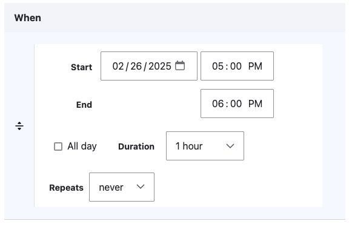

#### Spanning Multiple Days

We can also have events that span multiple days. For this, you need to check the
*All day* checkbox and then fill out the start and end dates.

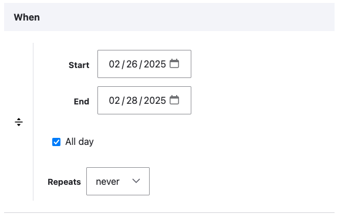

#### Repeating

Another type of events is repeating events. For this, fill in the start date and
time and the end time. Then select the repeating frequency.

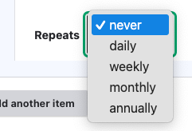

Then add the frequency and when the series should end (after a certain date, or
after a certain number of occurences).

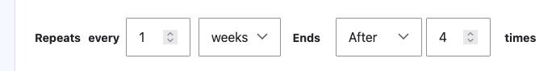

#### Multiple Arbitrary Dates and Times

The last and maybe most complicated way to do this is multiple unrelated,
occurences.

For this, you can fill the field out for one occurence using any of the above
options. Then click the button labeled "Add another item".

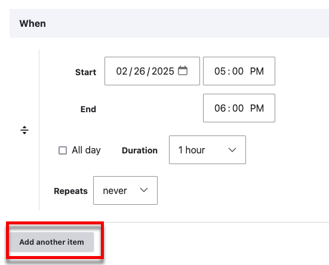

Then fill the new occurence out using any of the above methods.

This is how you can create an event that has multiple occurences that don't
follow a pattern.

!!! example

    An example of this type of event might be parent/teacher conferences that take place on a Monday, Tuesday and Thursday.

    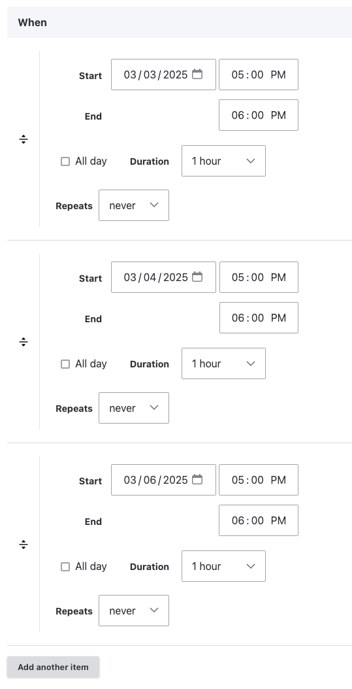

### The "Calendar" Field

Similar to [Tags](tagging-content.md), Calendars can be used to group events.
The difference is that Calendars change the way the events display in the
calendar. You can add an existing or new calendar.

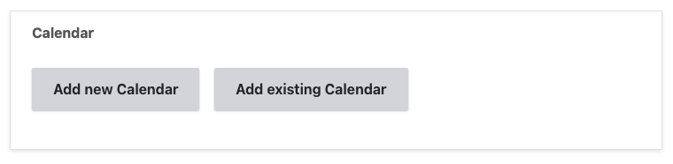

#### Adding an Existing Calendar

Add an existing calendar is similar to [tags](tagging-content.md). Just start
typing and the calendar name will autocomplete.

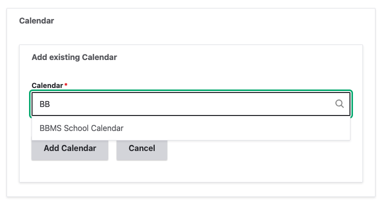

Then click *Add Calendar*

#### Adding a New Calendar

When you add a calendar, first give it a name. Then select a color. This is the
color that it will be in the calendar view.

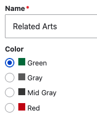

Now you can see that the new item event show up with our chosen color:

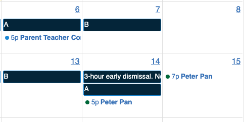
