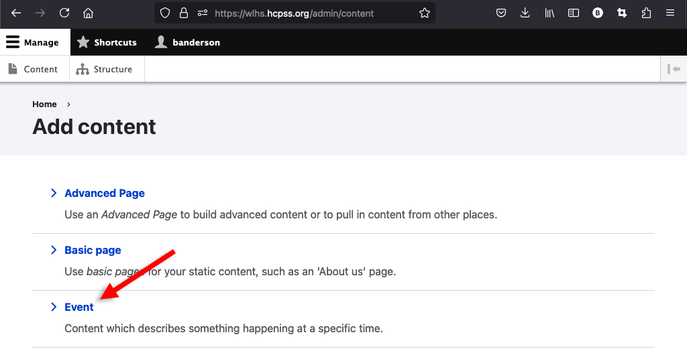
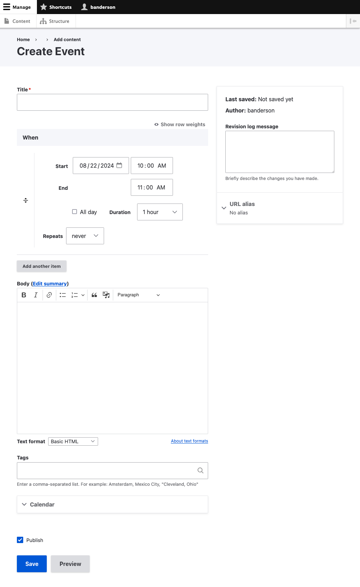

# Creating and Editing Events

> **Note**: the following instructions are only relevant to Drupal (non-Google) 
> calendars. Creating events in Google calendars is a different process.

## Creating Events

As with [news messages](creading-and-editing-news-messages.md), there are two 
ways to create new events:

### Option 1

Click *Manage > Content > Add content*:

And then *Event*:

### Option 2

Navigate to your calendar and click *Add an Event*:

## Editing an Event

**Title**, **Body**, **Tags**, and **Publish** should be familiar to you from the
[Creating and Editing News Messages](creading-and-editing-news-messages.md) 
topic, but there are 2 new fields:

### When

This field lets people know when the event is happening.

#### Simple Events

Simple events that have a start and end time.

#### Multi-day Events

Full day events that span days.

#### Repeating Event

Events that follow a repeating pattern.

#### Multiple Time Event

Events that repeat, but to not follow a pattern.

### Calendar

Assigning an event to a calendar is completely optional, but it can be a good way 
to visually differentiate between different types of events when the calendar 
gets crowded. 

Once you have created an event,  it will appear on your website calendar. It 
will also automatically be published to the HCPSS app and be assigned a unique 
URL, which you can share on social media, include in school messages, etc. You 
can also pin your event to your homepage as a homepage highlight and create a 
news message about it to give it additional visibility on your website.
