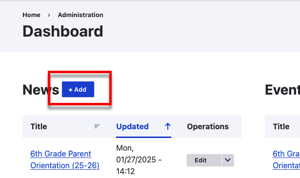
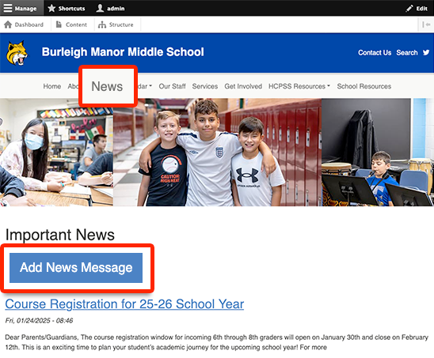
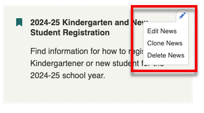
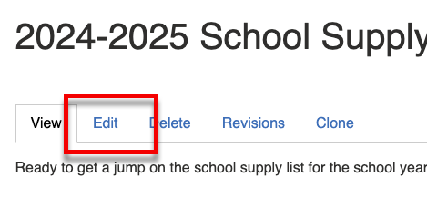

---
tags:
  - updated
---
# Creating and Editing News Messages

News messages are a key way to highlight new or existing information on your
school website.

## Creating News Messages

This video covers creating news messages. The same material is also covered
below.

<video style="width: 100%" loop="" muted="" controls="" alt="type:video">
    <source src="../videos/adding-a-news-message.mov" type="video/mp4">
    <track label="English" kind="subtitles" srclang="en" src="../captions/vtt/adding-a-news-message.vtt" default>
</video>

There are two ways to add a new news message. Via the dashboard or the front
end.

### Via the Dashboard

The first is to go to dashboard and in your news block, click Add.

### Via the Frontend

The second is to go to the news listing on the front end and click Add News message.

Fill out the following fields:

1. Title
2. A summary - This should be 1-2 sentences that summarize the news post.
3. Body - [see Using the Rich Text Editor](using-the-rich-text-editor.md)
4. Tags - [see Tagging Content](tagging-content.md)
5. Publish - Leave this checked to publish the news item right away. If you
   uncheck this, the news item will be saved but will not be visible to the
   public. You can find the news item again on your dashboard and publish it
   later.

Once you have filled out the fields, click *Save*.

## Editing News Messages

This video covers creating news messages. The same material is also covered
below.

<video style="width: 100%" loop="" muted="" controls="" alt="type:video">
    <source src="../videos/editing-news-messages.mov" type="video/mp4">
    <track label="English" kind="subtitles" srclang="en" src="../captions/vtt/editing-news-messages.vtt" default>
</video>

We can edit news posts in multiple ways.

The first way is to use the context menu. The context menu displays a pencil
icon when you hover over editable content:

The other way to do it is to navigate to the actual news item. And click the
edit tab.

Once you have finished setting up your news message, click save. Your message
will now appear as the first item on your “News” page. It will also
automatically be published to the HCPSS app and be assigned a unique URL, which
you can share on social media, include in school messages, etc. You can also pin
your news message to your homepage as a homepage highlight.
