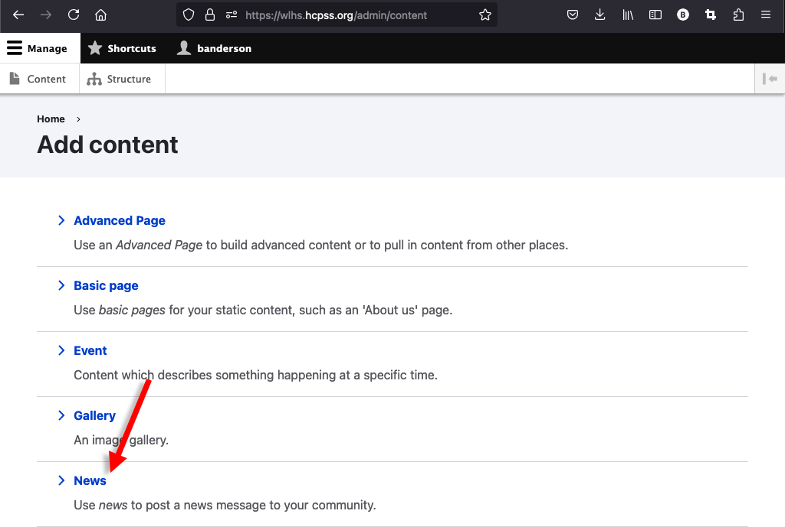
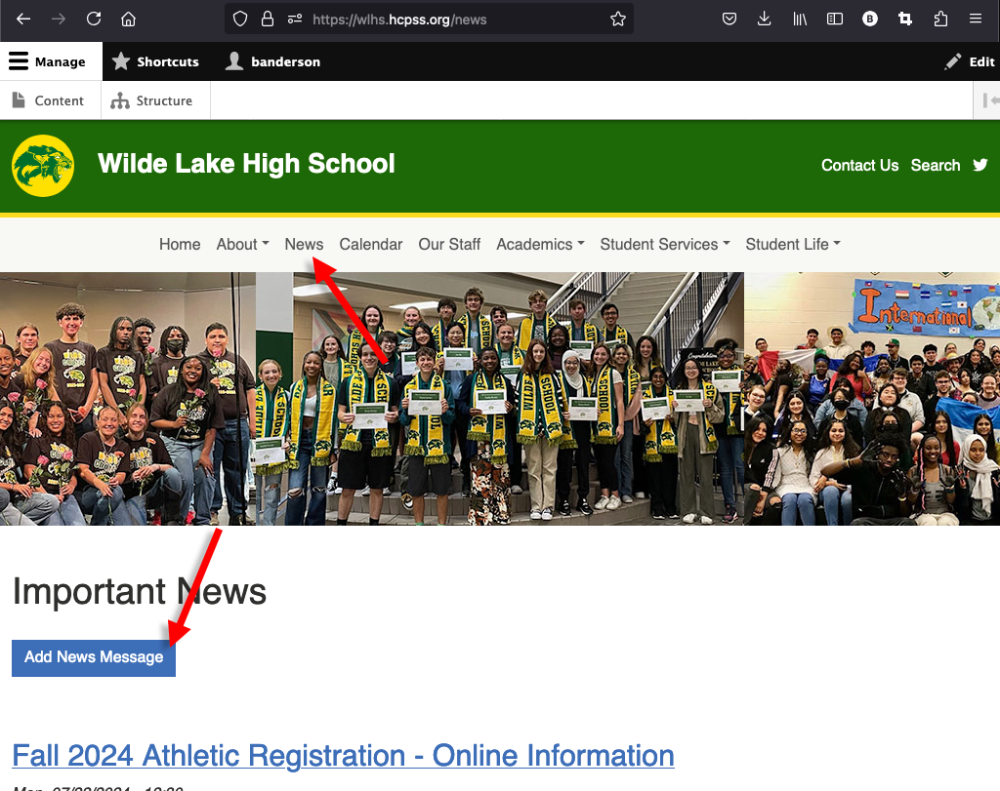
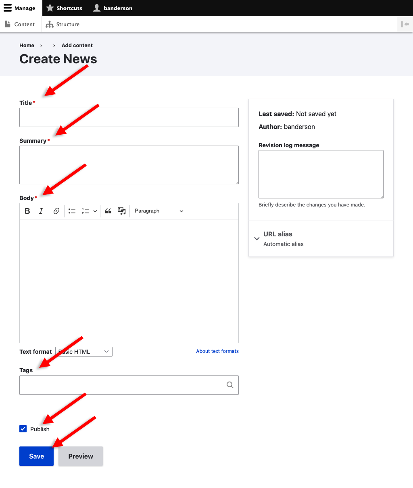

# Creating and Editing News Messages

News messages are a key way to highlight new or existing information on your 
school website.

## Creating News Messages

There are two ways to begin a news message:

### Option 1

Go to the [Content Overview page](content-overview.md) by clicking *Manage > 
Content* in the toolbar and then *Add content*:

And then *News*.

### Option 2

Go to the *News* page and click *Add News Message*. 

## Editing News Messages

Insert information including:

* **Title**
* **Body**: This is the “meat” of your news message.
* **Summary**: This is a “teaser,” designed to inspire audiences to 
  read your full news message. It should be brief (one or two short sentences) 
  and where appropriate include a call to action (i.e. “Learn more,” “Join us,” 
  “Download the form,” etc.).
  
  The text used here will appear under your news message title on your site’s 
  “News” page as well as on your homepage if you choose to make this news item 
  one of your homepage highlights.
* **Tags** (optional): Here you can tag your news item to help your users find
  related content. For example, you could tag all news posts related to 
  transportation with "Transportation" or all news related with getting ready 
  for the 24-25 school year with "Getting Ready for 24-25". Use as many or few
  tags as you would like.
* **Publish**: Uncheck this to save the news item, but keep it private. You can 
  come back later and publish it.

In general, we recommend:

* Keeping paragraphs short (2-3 sentences).
* Using bold, italics, headings, and lists to call visual attention to key 
  information.
* Copying and pasting text from other sources (i.e. Word, websites, Google docs, etc.) into Notepad (on PCs) or TextEdit (on Macs) and then copying and pasting from Notepad/TextEdit into your news message. Taking this extra step will help to minimize the likelihood of formatting issues in your news message.

See Towson University's [Writing for the Web](https://www.towson.edu/web-guidelines-resources/content-standards-best-practices/writing/)
for more information about effective writing for the web.

Once you have finished setting up your news message, click save. Your message 
will now appear as the first item on your “News” page. It will also 
automatically be published to the HCPSS app and be assigned a unique URL, which 
you can share on social media, include in school messages, etc. You can also pin 
your news message to your homepage as a homepage highlight.
