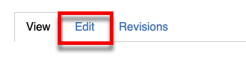
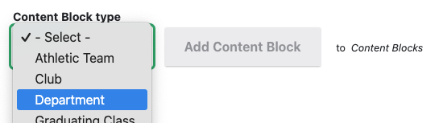
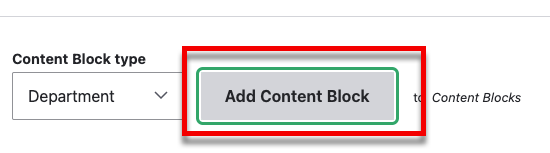

---
tags:
  - updated
---
# Creating and Managing Staff Lists

This video covers creating and managing staff lists. The same materil is covered
below.

<video style="width: 100%" loop="" muted="" controls="" alt="type:video">
    <source src="../videos/managing-staff-list.mp4" type="video/mp4">
    <track label="English" kind="subtitles" srclang="en" src="../captions/vtt/managing-staff-list.vtt" default>
</video>

## Editing a Department

To add a staff member to a department, navigate to the staff page:

The staff page is made up of departments.

Hover over a department to active the context menu

Or click on *Edit* on the right side of the toolbar to activate all context menus.

Click the pencil icon and then *Edit Department*.

### Add Staff

On the *Edit Department* page (follow
[instructions above](#editing-a-department)), Scroll down to the *Staff Members*
section and click *Select*

Here we can add an existing person searching.

Then checking the checkbod next to the person and clicking the *Select* button
(scroll to the bottom).

Or create a new person.

Whether you select a new or existing person, you should now see them in the
*Staff Members* section.

You can drage people around to reorder them

### Remove Staff

On the *Edit Department* page (follow
[instructions above](#editing-a-department)), scroll down to the *Staff Members*
section. Then click *Remove* next to the person you want to remove.

Make sure you save the department when you are done.

### Adding Department Photos and Information

On the *Edit Department* page (follow
[instructions above](#editing-a-department)), scroll down to the *Description*
section.

This field uses a Rich Text Editor. It supports everything other Rich Text
Editor fields to, including images, lists and links. This is a great place to
put department photos, phone numbers, websites, and other information.

[See more about using the Rich Text Editor](using-the-rich-text-editor.md)

Whatever you enter here will be displayed on the staff page.

## Editing a Person

To edit a staff member, navigate to the staff page:

Hover over a person to active the context menu

Or click on *Edit* on the right side of the toolbar to activate all context menus.

Click the pencil icon and then *Edit Person*.

Then edit the person and click save.

## Adding a Department to the Page

To add a department, navigate to the staff page.

Then click the Edit tab.

Scroll to the bottom of the *Content Blocks* section to the select list labeled
*Content Block Type*.

Then click *Add Content Block*.

This will add a blank *Department* content block. In the new block click
*Select*.

Here you can add an existing or new department.

### New Department

Fill out the form to add a department. Make sure to give it a title. You can
add new or existing people.

Use the autocomplete field to add find existing people.

When you are done, click *Save*.

### Existing Department

Use the search box to search for a department. Then click the radio button next
to the department and click *Select*.

### The Department Content Block

Whether you create a new, or add an existig, department you should now see it in
the new department content block.

#### Overriding the Title

You can override the department title.

When you use this field, the title of the department will remain the same, but
it will be overridden on the current page.

!!! question "Why Would You Want to Override the Department Title"

    On the staff page, you probably wouldn't, but departments can be added to
    other pages too. So imagine a *World Language* page where you want to list
    the world language staff. You already have a *World Language* department,
    but you probably don't want the department to be labeled "World Language"
    because users are already on the *World Language* page.

    In this case, you might want to everride the title with something like
    "Staff" or "Support Staff".

#### Reordering Departments

##### Arrow Buttons

Beside each content block, there are up and down arrows that can be used to move
the block up and down one position.

##### Drag and Drop

Beside each content block there is an icon that you can use to drag the block
up or down in order.

Because these blocks often take up much of the screen space, dragging and
dropping then can be challenging. The next technique addresses this.

##### Using the Drag and Drop Overview

At the top of the *Content Blocks* section, there are 3 dots. Click on those and
then *Drag and drop overview*.

This colapses the blocks to a smaller size making it easier to drag and drop
them.

**Make sure you click *Complete drag & drop*** when you are done.

