# Creating and Managing Staff Lists

This video covers creating and managing staff lists. The same materil is covered
below.

<video style="width: 100%" loop="" muted="" controls="" alt="type:video">
    <source src="../videos/managing-staff-list.mp4" type="video/mp4">
    <track label="English" kind="subtitles" srclang="en" src="../captions/vtt/managing-staff-list.vtt" default>
</video>

The *Our Staff* page is an Advanced Page.

[See the *Advanced Pages* page for more information.](advanced-pages.md) 

## Editing a Department

To add a staff member to a department, navigate to the staff page:

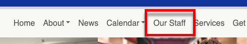

The staff page is made up of departments.

Hover over a department to active the context menu

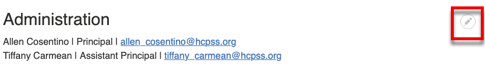

Or click on *Edit* on the right side of the toolbar to activate all context menus.

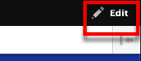

Click the pencil icon and then *Edit Department*.

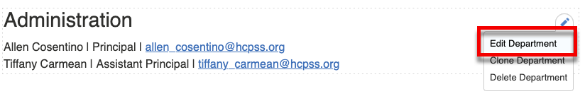

### Add Staff

On the *Edit Department* page (follow
[instructions above](#editing-a-department)), Scroll down to the *Staff Members*
section and click *Select*

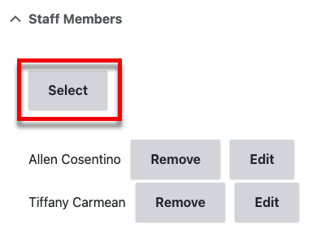

Here we can add an existing person searching.

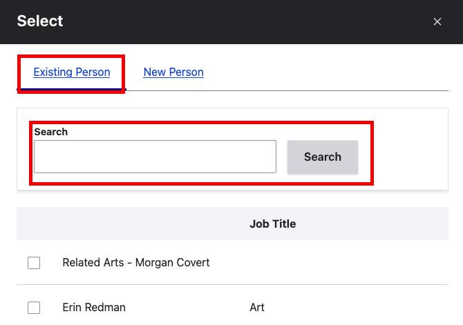

Then checking the checkbod next to the person and clicking the *Select* button
(scroll to the bottom).

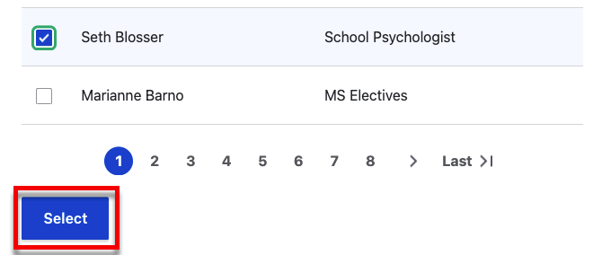

Or create a new person.

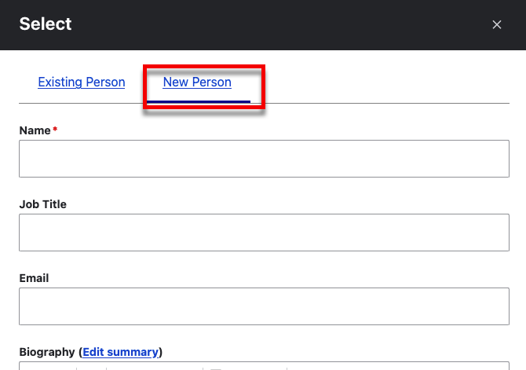

Whether you select a new or existing person, you should now see them in the
*Staff Members* section.

You can drage people around to reorder them

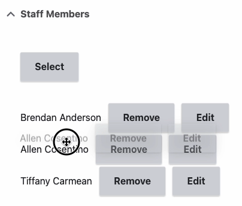

### Remove Staff

On the *Edit Department* page (follow
[instructions above](#editing-a-department)), scroll down to the *Staff Members*
section. Then click *Remove* next to the person you want to remove.

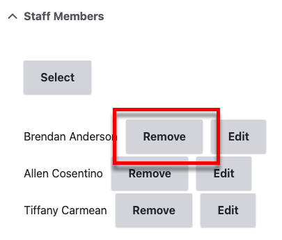

Make sure you save the department when you are done.

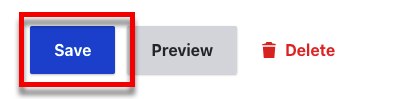

### Adding Department Photos and Information

On the *Edit Department* page (follow
[instructions above](#editing-a-department)), scroll down to the *Description*
section.

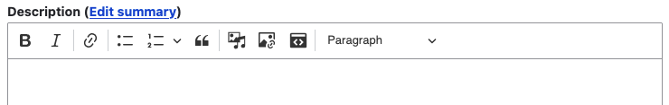

This field uses a Rich Text Editor. It supports everything other Rich Text
Editor fields to, including images, lists and links. This is a great place to
put department photos, phone numbers, websites, and other information.

[See more about using the Rich Text Editor](using-the-rich-text-editor.md)

Whatever you enter here will be displayed on the staff page.

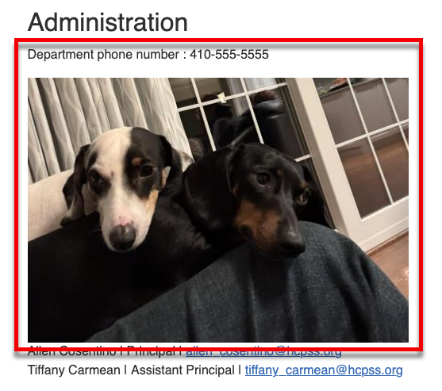

## Editing a Person

To edit a staff member, navigate to the staff page:

Hover over a person to active the context menu

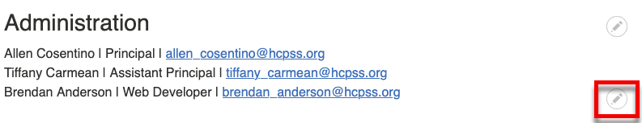

Or click on *Edit* on the right side of the toolbar to activate all context menus.

Click the pencil icon and then *Edit Person*.

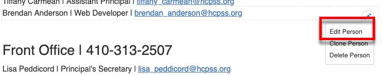

Then edit the person and click save.

## Adding a Department to the Page

[See the Department section of the Advanced Pages page.](advanced-pages.md#departments)

