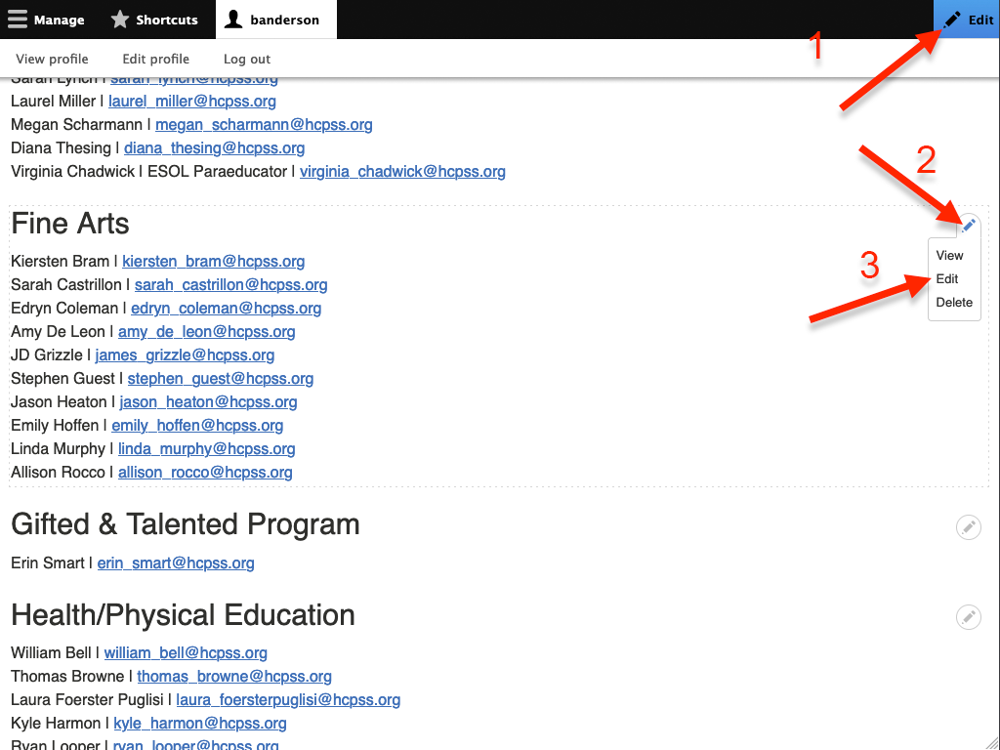
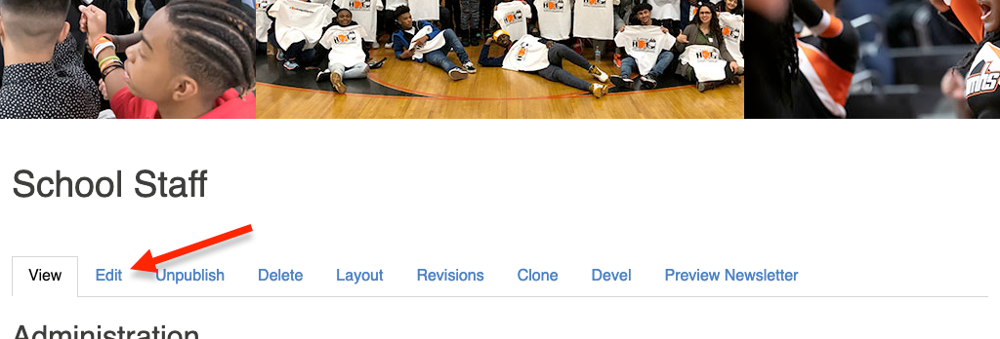

# Creating and Managing Staff Lists

## Adding Staff to an Existing Department

Start by navigating to your Staff Listing

Then show the editable regions by clicking *Edit* in the upper right area in the
toolbar. Then click on the pencil icon and *Edit*.

Here you can add or remove new or existing staff members.

## Adding a New Department to the School Staff Page

Start by navigating to your Staff Listing

Then click *Edit*.

The add a new or existing department.

