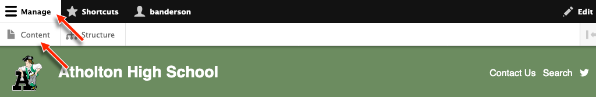
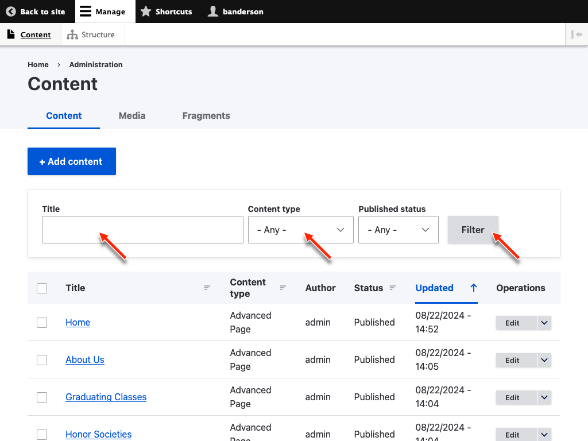
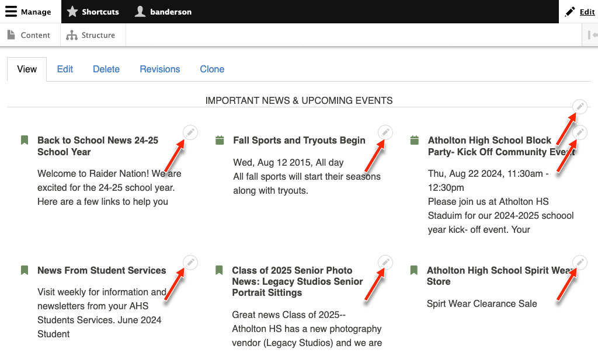
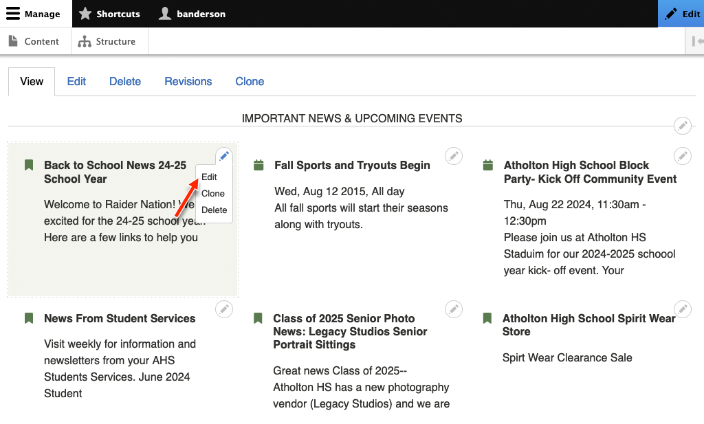

# Finding Content

## Finding Content from the Back End

When you are [logged in](logging-in.ms) you can access the Content Overview by 
clicking *Manage > Content*:

Here you can filter content by title and content type:

You can view the content my clicking the title and edit it by clicking *Edit* on
the right.

## Finding Content From the Front End

When you navigate to a page on the front end, if the page is editable, you will
see *Edit* in the content tabs (visible when you are logged in).

Some pages are made up of difference pieces of editable content that you can 
edit whether the page itself is editable or not.

You can show these editable pieces by clicking on *Edit* in the toolbar:

This will make a pencil icon appear next to any editable content:

When you click one of these, you will have the option to edit, clone, or delete 
it:

