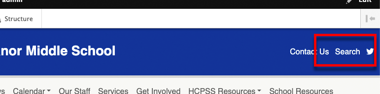
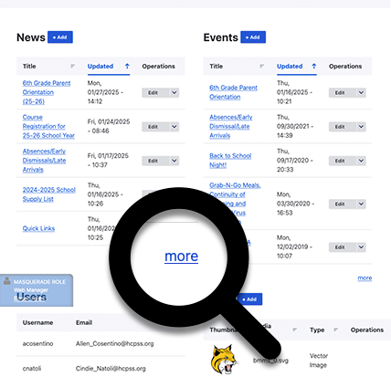
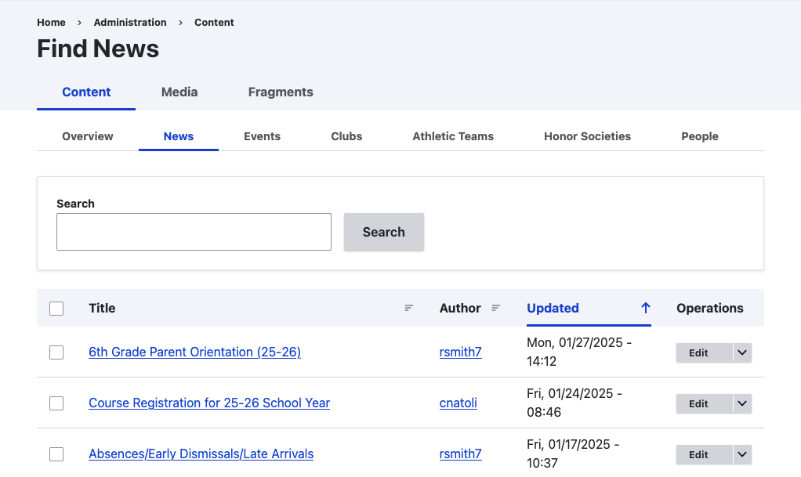
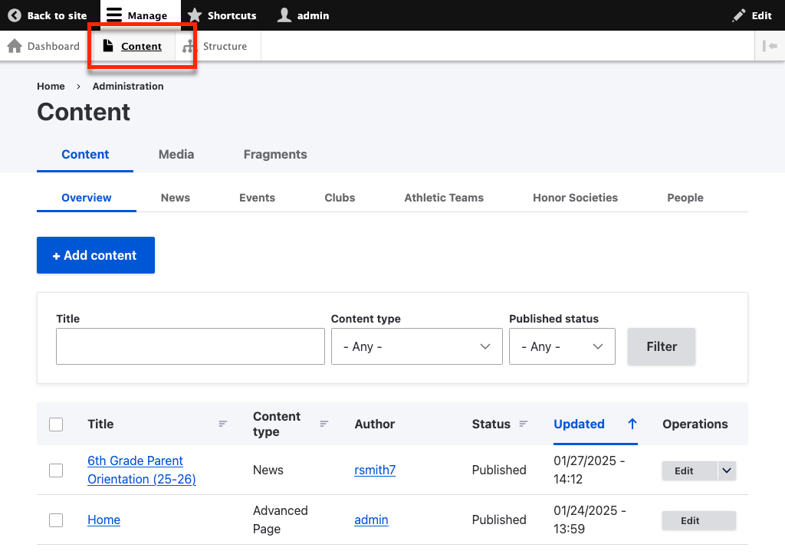

---
tags:
  - updated
---
# Finding Content

<video style="width: 100%" loop="" muted="" controls="" alt="type:video">
    <source src="../videos/finding-content.mp4" type="video/mp4">
    <track label="English" kind="subtitles" srclang="en" src="../captions/vtt/find-content.vtt" default>
</video>

There are a lot of ways to find content on your site.

## Browsing the Front End

One way is to just find it on the front end like a user would. If you're looking for a news item that was, created recently, you can find it in the news list at /news.

## Using the Site Search

Another way is to just search for it using the site search at /search or by clicking *Search*.

## Via the Dashboard

Another way is to go to your dashboard and click *more* below the block of content you want to search.

This will take you to a more complete view of the content, where you can search and sort.

## Using the Content Overview

If all else fails, the most powerful way to find content is to go to click on *Content* in the toolbar. This will take you to the *Content Overview* where you can search, filter and sort all content.

