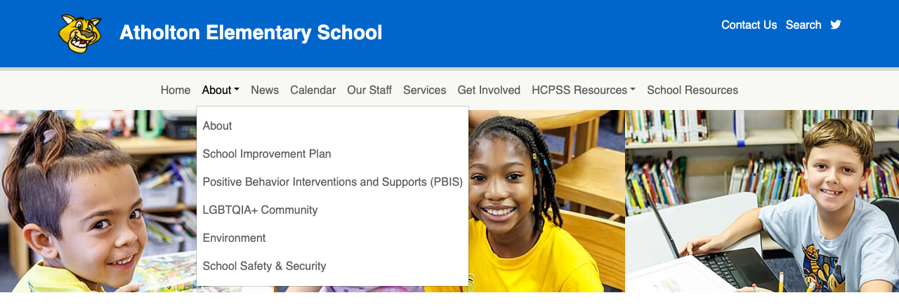
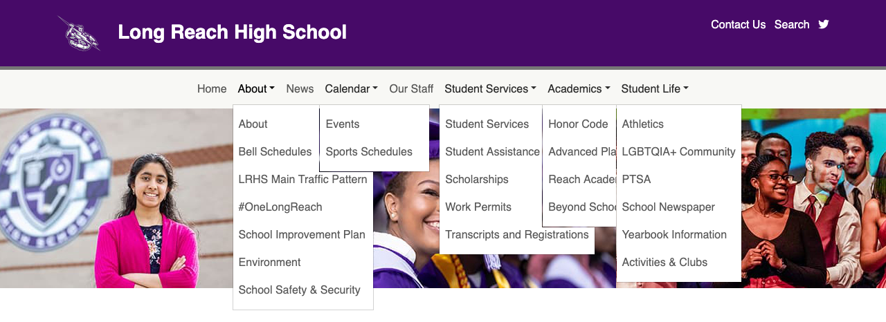
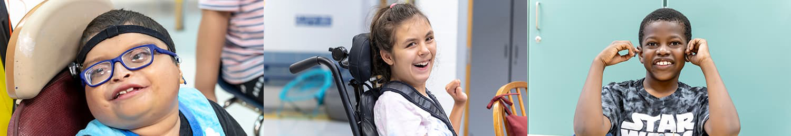
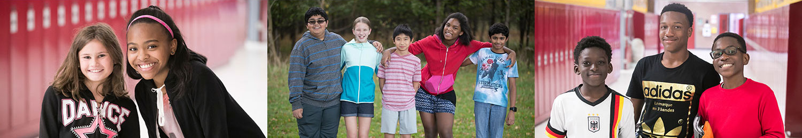
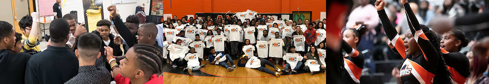
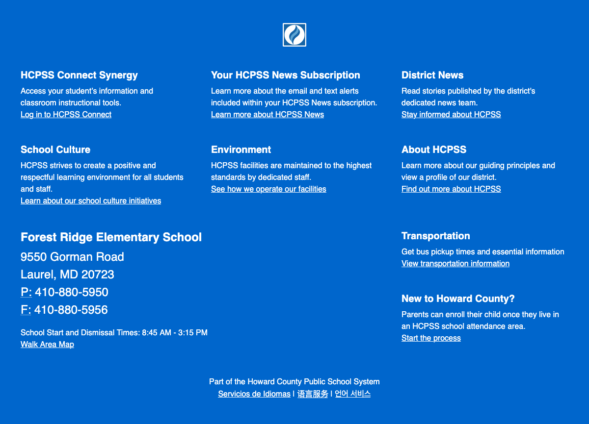
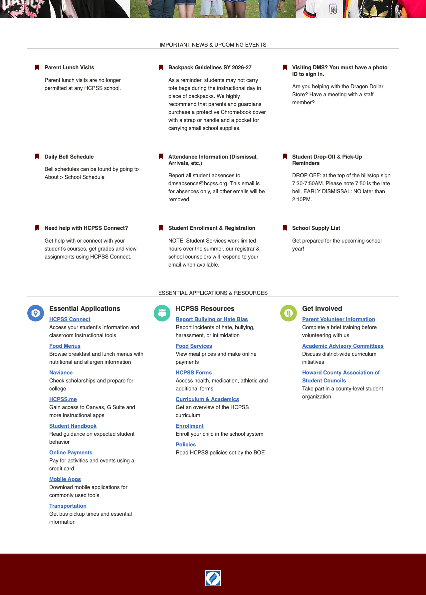

# A Tour of Your School's Website

## Main Menu

The top level items in the menu are set by the Communications team, but do 
differ slightly between Elementary/Middle and High schools.

The children of the top level items can be changed, but we make an effort to
maintain consistency.

There are 4 types of items in the menu:

1. :material-pencil: Pages that you can edit directly
2. :material-format-list-text: Pages that are a dynamic view of content
3. :material-lock: Pages that are managed centrally and cannot be edited
4. :material-open-in-new: Links to external resources

Below are typical menu items. Your school make not have all of these and it may
have some that are not listed here.

**Elementary/Middle Menu:**

- **Home** :material-pencil: [Read more about the homepage below](#homepage).
- **About**
    - **About** :material-pencil: You should update this page at least once a 
      year to make sure the information is up to date. This an Advanced Page, 
      [read more about Advanced Pages](../advanced-pages.md).
    - **School Improvement Plan** :material-pencil: You should update this page
      whenever you get a new SIP.
    - **Positive Behavior Interventions and Supports (PBIS)** :material-pencil: 
      You should update this page whenever you get a new PBIS.
    - **LGBTQIA+ Community** :material-lock: This page has some content on it 
      that is set by the Multimedia Communications team to be consistent across
      all school sites, however you can add additional information. This an 
      Advanced Page, [read more about Advanced Pages](../advanced-pages.md).
    - **Environment** :material-lock: This page content is set by the Multimedia 
      Communications team to be consistent across all school sites.
    - **School Safety & Security** :material-lock: This page content is set by 
      the Multimedia Communications team to be consistent across all school 
      sites.
- **News** :material-format-list-text: This is a list of your News messages, 
  most recent first. So it is nor directly editable. 
  [Read more about News messages](../creating-and-editing-news-messages.md).
- **Calendar** :material-format-list-text: The calendar contains your events.
  [Read more about events](../creating-and-editing-events.md).
- **Our Staff** :material-pencil: You should update this at the beginning of the 
  year. 
  [More information about the staff list](../creating-and-managing-staff-lists.md). 
- **Services** :material-pencil: This page contains information about school
  services such as meals, FARMs, before and after care, etc. It also contains 
  legally mandated information about Accident and Medical insurance that you
  cannot edit or remove. But the page is otherwise and editable Advanced Page
  [read more about Advanced Pages](../advanced-pages.md).
- **Get Involved** :material-pencil: A good place to put information about
  volunteering and PTA. This an Advanced Page, 
  [read more about Advanced Pages](../advanced-pages.md).
- **HCPSS Resources** :material-open-in-new: All items under here link to HCPSS
  resources outside of your site. This is managed by the Multimedia 
  Communications team and is consistent across all sites.
- **School Resources** :material-pencil: A good place to put information about
  academic and other resources. This an Advanced Page,
  [read more about Advanced Pages](../advanced-pages.md).

**High School Menu:**

- **Home** :material-pencil: [Read more about the homepage below](#homepage).
- **About**
    - **About** :material-pencil: You should update this page at least once a
      year to make sure the information is up to date. This an Advanced Page,
      [read more about Advanced Pages](../advanced-pages.md).
    - **School Improvement Plan** :material-pencil: You should update this page
      whenever you get a new SIP.
- **News** :material-format-list-text: This is a list of your News messages,
  most recent first. So it is nor directly editable.
  [Read more about News messages](../creating-and-editing-news-messages.md).
- **Calendar** :material-format-list-text: The calendar contains your events.
  [Read more about events](../creating-and-editing-events.md).
- **Our Staff** :material-pencil: You should update this at the beginning of the
  year.
  [More information about the staff list](../creating-and-managing-staff-lists.md).
- **Student Services** :material-pencil: This page contains information about 
  counseling, registration and academic resources. This is an Advanced Page
  [read more about Advanced Pages](../advanced-pages.md).
- **Academics**
    - **Honor Societies** :material-format-list-text: A list of your Honor 
      Societies. [Read more about honor societies](../programs.md).
    - **Graduating Classes** :material-format-list-text: A list of your 
      Graduating Classes. [Read more about graduating classes](../programs.md).
- **Student Life**
    - **Activities & Clubs** :material-format-list-text: A list of your Clubs. 
      [Read more about clubs](../programs.md).
    - **Athletic Teams** :material-format-list-text: A list of your Athletic
      Teams. [Read more about athletic teams](../programs.md).
    - **LGBTQIA+ Community** :material-lock: This page has some content on it
      that is set by the Multimedia Communications team to be consistent across
      all school sites, however you can add additional information. This an
      Advanced Page, [read more about Advanced Pages](../advanced-pages.md).

## Banner

The banner is made up of 3 images and they should give visitors an idea of what 
your school is all about: students.

If you want to change these photos, contact 
[webmaster@hcpss.org](mailto:webmaster@hcpss.org). If you do not already have 
new photos, 
[submit a multimedia request](https://docs.google.com/forms/d/e/1FAIpQLScE34PoWeOxjkqc-gWA7skdMLDkdyj_oZ_sXf6g03YAYGXPag/viewform) 
to schedule a visit from the photographer or to review other possible existing 
photos.

## Footer

Your site footer contains your school address, hours, phone/fax numbers and 
walk area map. The Multimedia Communications Team is responsible for keeping 
this information up to date.

## Homepage

The homepage is important for giving people the most important and relevant 
information. It is made up of 2 parts:

1. Important News & Upcoming Events
2. Essential Applications and Resources

### Important News & Upcoming Events

The Homepage Highlights are where you can highlight the most important 
information for visitors to your site.

!!! note "Further Reading"
    - [When to update your Homepage Highlights](what-are-web-managers-being-asked-to-do.md#monthly)
    - [How to update your Homepage Highlights](../managing-homepage-highlights.md)

### Essential Applications and Resources

This section let people know about HCPSS applications and resources as well as
how they can get involved with your school. Contact 
[webmaster@hcpss.org](mailto:webmaster@hcpss.org) to make updates to this 
section.
