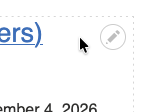
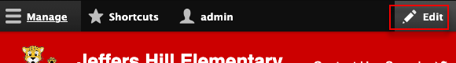
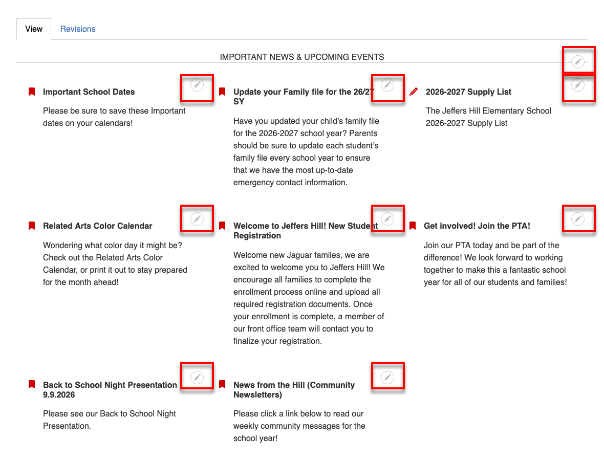
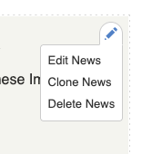

# Using the Context Menu

## What is the Context Menu?

The context menu is a powerful tool that allows you to initiate many actions.

!!! tip "Log In"
    Make sure you are logged in to see the context menu.

{ align=right }

When you hover your mouse over a piece of content that you can perform an action
on (edit, clone, delete, etc.) a pencil icon will show in the upper right: 

Instead of hunting around with your mouse to find actionable content, you can 
click **Edit** in the toolbar:

Then all the pencil icons will be shown.

## What Can You Do With the Context Menu?

{ align=left }

*Edit, Clone, and Delete* are commonly found in the context menu, but they may
not all be availabe or there may be additional items depeding on the possible 
actions that can be performed on that content.

