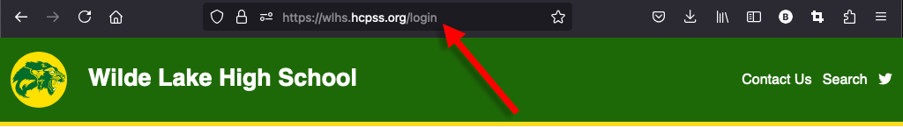
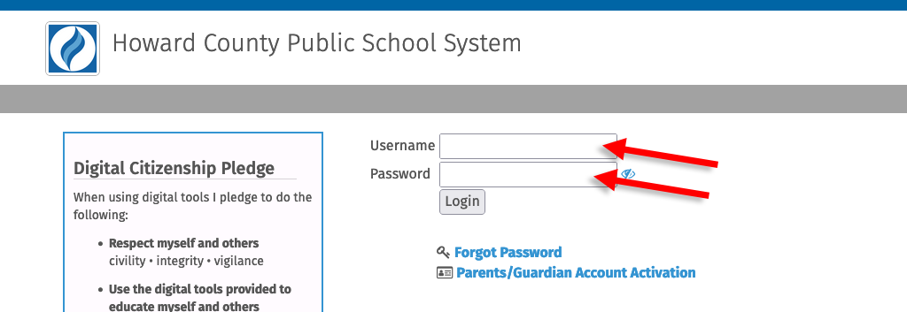
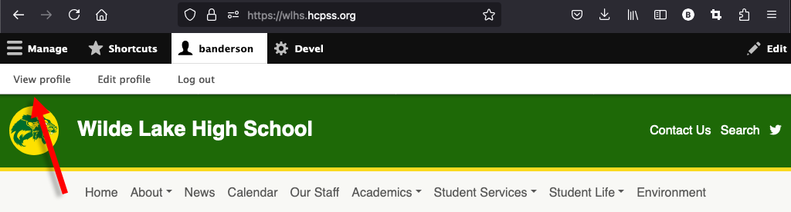
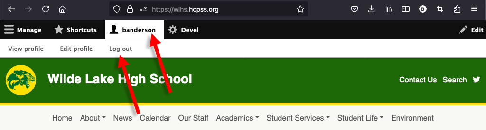

---
tags:
  - updated
---
# Logging In

Log into your school's website by going to your school's website and adding
"/login" to the end of the website URL (i.e. "http://waves.hcpss.org/login").

You will be redirected to the HCPSS login page. Enter your HCPSS credentials.

You will know you’re logged in when the black and grey tool bar appears at the
top of your screen.

To log out, click your username and then "log out" in the toolbar.

