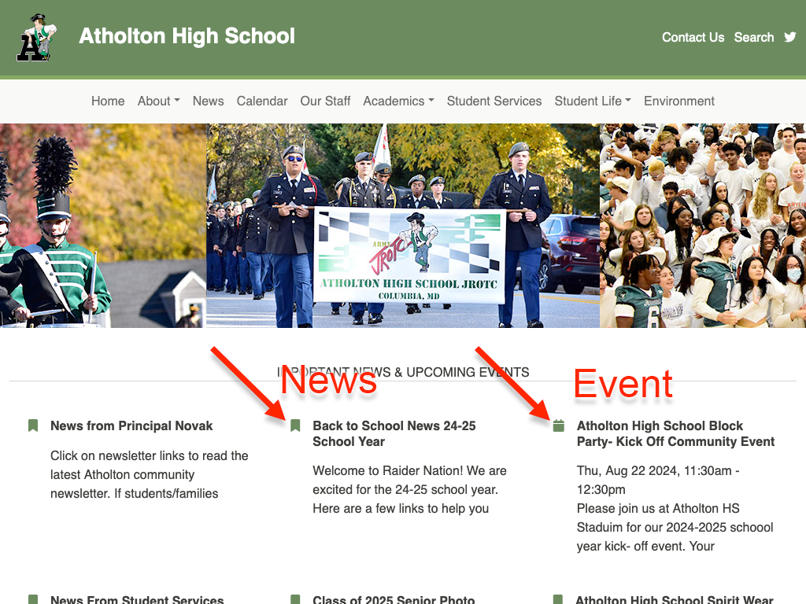

# Managing Homepage Highlights

As you think about how to use this space on your website, keep in mind the 
following:

* You can highlight up to 9 news messages/events at a time, but you're not 
  required to do so.  Use this space to highlight important/time-sensitive 
  information; don't highlight outdated information simply to fill space. That 
  said, we recommend featuring  no less than 3 highlights at a given time 
  (otherwise, it seems like nothing noteworthy is happening at your school).
* Highlights are text-only. Links, images, and attachments may be included in 
  the news messages/events that site visitors link to when they click on a given 
  highlight.

{: style='height: 26vw'}
