# Managing Homepage Highlights

## Using the Context Menu

To edit your homepage highlights activate the context menu by hover over the
highlights area and clicking on the pencil icon.

Alternatively, you could click on *Edit* on the right side of the toolbar.

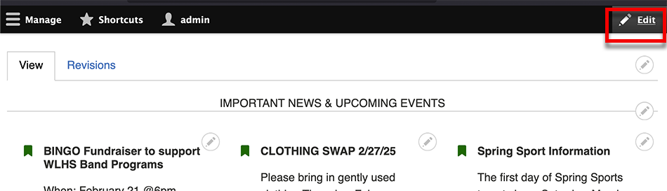

This will activate all the context areas and show a pencil icon on the upper 
right of any content you can edit.

Click on the icon and then *Edit Highlights*.

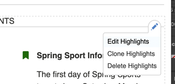

## Using the Dashboard

There us a link to edit your homepage highlights on your dashboard.

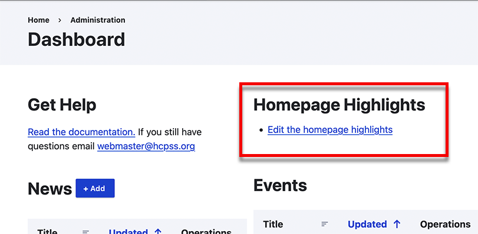

## Reorder Highlights

You can reorder the highlights by dragging them and dropping them.

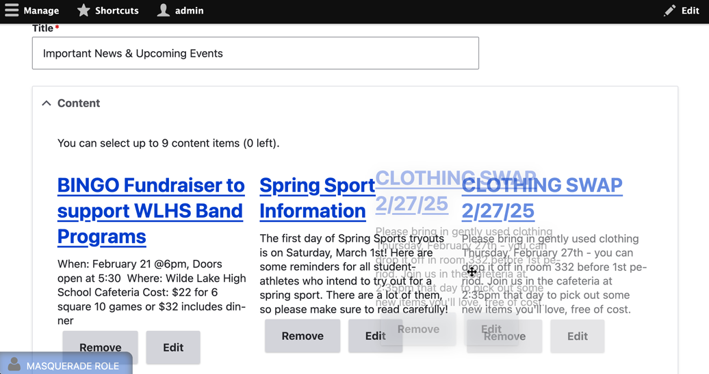

## Remove Highlights

You can remove a highlight by clicking *Remove* on any of them.

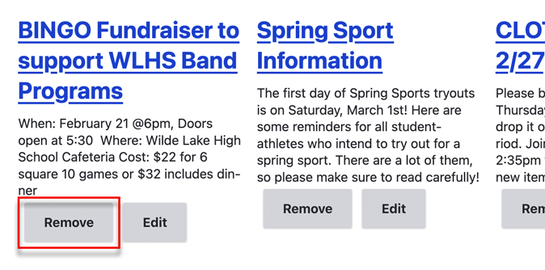

## Add a Highlight

To add a highlight click Add.

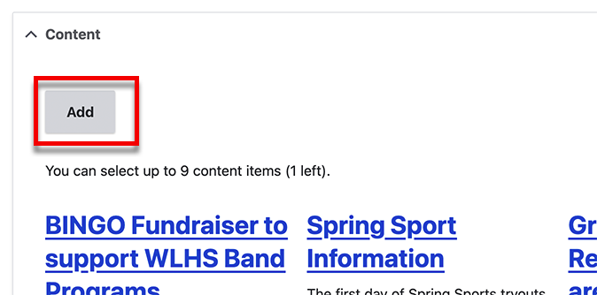

Once you click *Add* you will be presented with a page where you can find or
create news items or events.

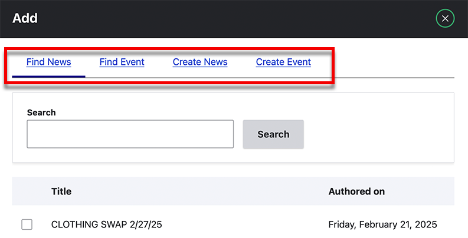

### Use Existing News or Event

When finding news or evens you will be presented with a search box where you 
can search for news or events.

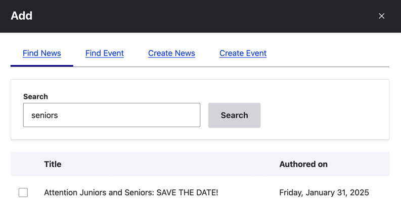

To select on click on the checkbox next to it and then *Select* at the bottom.

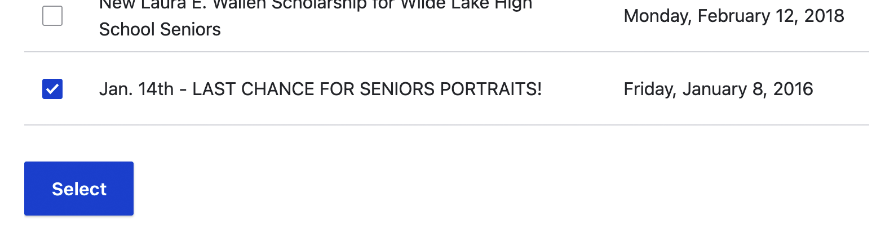

You should now see your highlight.

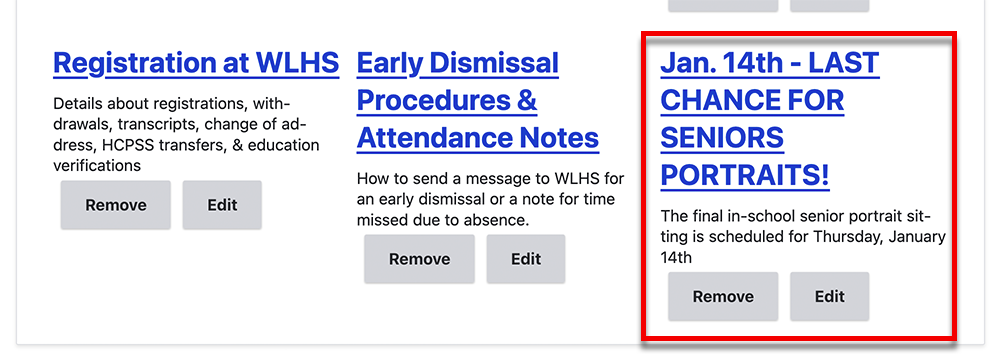

### Create a New News Item or Event

To create a new news item or event (and automatically add it to the highlights)
click the link in the tab.

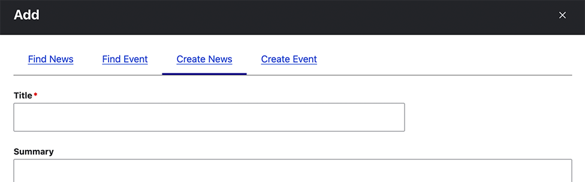

Fill out the form see
[Creating and Editing Events](creating-and-editing-events.md) or [Creating and
Edit News Messages](creating-and-editing-news-messages.md) for more information.
Than click *Save*.

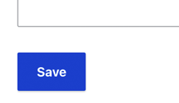
