# Newsletter Builder

The newsletter builder helps you streamline your email communications with your
community by allowing you to quickly build an email newsletter from existing 
content on the site.

## Starting a Newsletter

There are 2 ways to begin building a newsleter:

1. Start from a blank newsletter.
2. Create a newsletter from selected news items.

### Starting from Scratch

From your dashboard, scroll down to the *Newsletter* section and click *Add*.

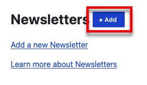

### Starting from the News list

From your dashboard, scroll down to the *News* section and click *more*.

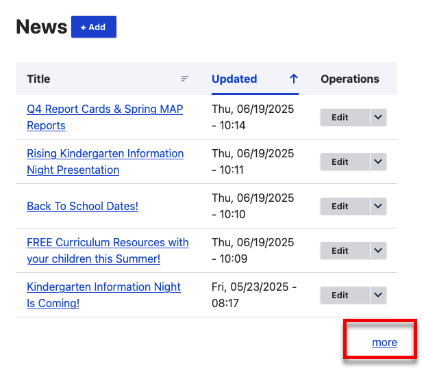

Then:

1. Select the news items you want to include in your newsletter
2. Select action *Create Newsletter*
3. Click *Apply to selected items*

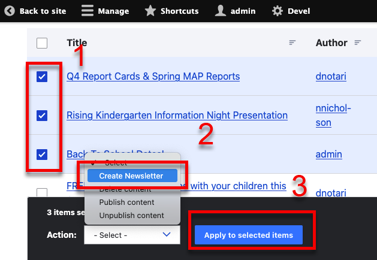

This will take you the the *Create Newsletter* form with the news items you
selected pre-filled.

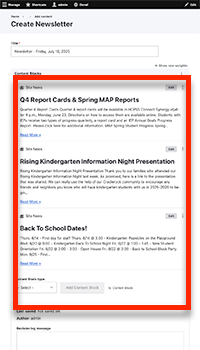

## The Newsletter Builder

Whether you start from scratch or start from the news list, you will find 
yourself on the *Create Newsletter* form. 
[Similar to Advanced Pages](advanced-pages.md), a newsletter is composed of 
individual content blocks. 

In this case the conent block types you can add are:

1. [**Site News**](#site-news): Select an existing news item on your site to 
   include in the newsletter.
2. [**Site Event**](#site-event): Select an existing event to include in your 
   newsletter.
3. [**Event List**](#event-list): Add a simple list of events.
4. [**Rich Text**](#rich-text): Add formatted text.
5. [**Community Events**](#community-events): Add a program from the 
   [HCPSS Community News and Programs](https://community-programs.hcpss.org/) 
   website which contains events and programs solicited from our community.
6. [**District News**](#district-news): Add a news item from the 
   [HCPSS News site](https://news.hcpss.org/).
7. [**Other School News**](#other-school-news): Add a news item from another 
   school.

### Content Blocks

#### Site News

Select *Site News* and then click *Add Content Block*

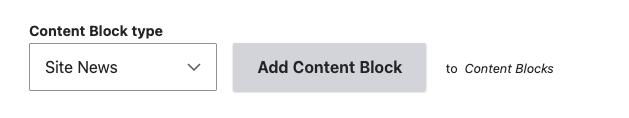

Then click *Select or Create News Item*.

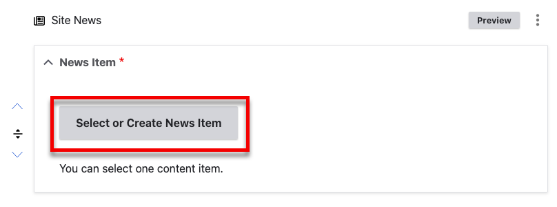

Then, select the news item you want to insert and click *Select*. 

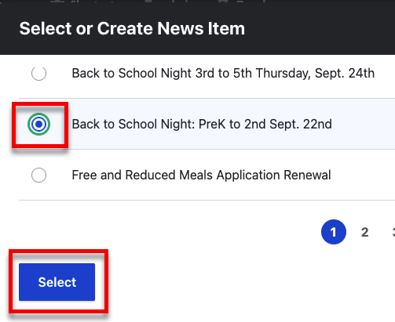

If you want to preview what the news item will look like in the newsletter, 
click *Preview*.

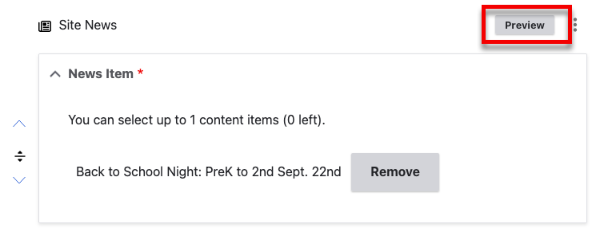

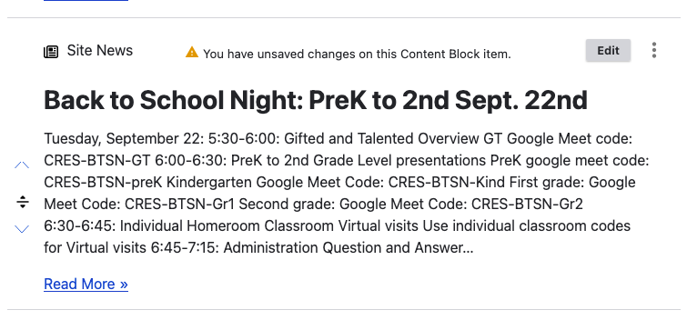

#### Site Event

Select *Site Event* and then click *Add Content Block*

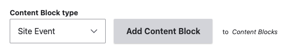

Then click *Select or Create Event*.

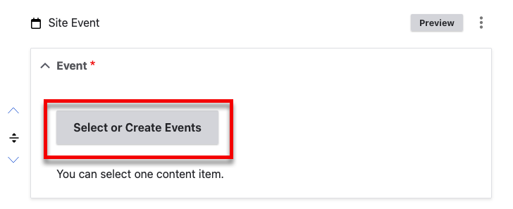

Then, select the event you want to insert and click *Select*.

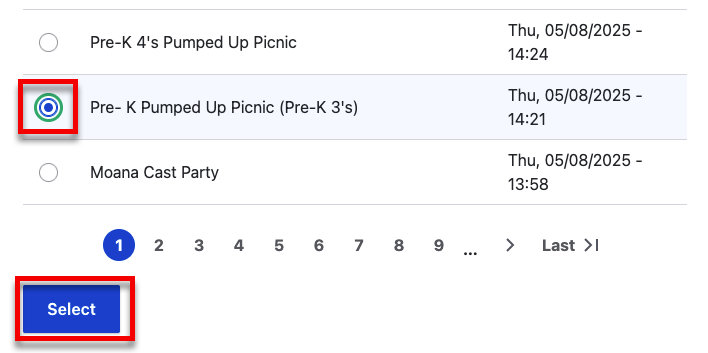

If you want to preview what the event will look like in the newsletter,
click *Preview*.

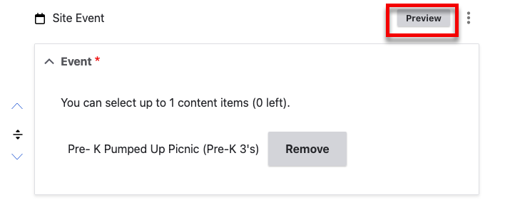

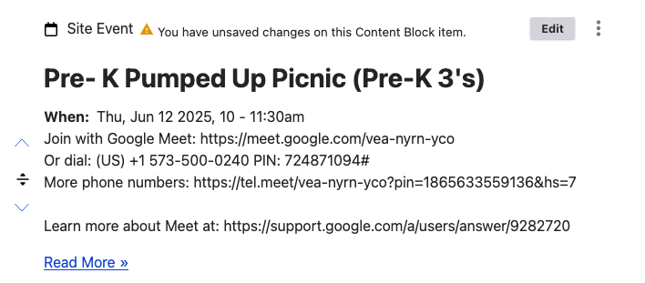

#### Event List

Select *Event List* and then click *Add Content Block*

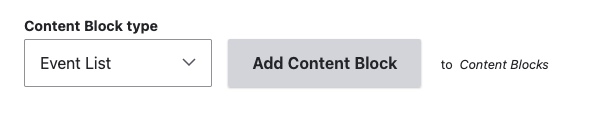

Give the event list:

1. A title (required)
2. A description (optional) 
3. Click *Select or Create Events*.

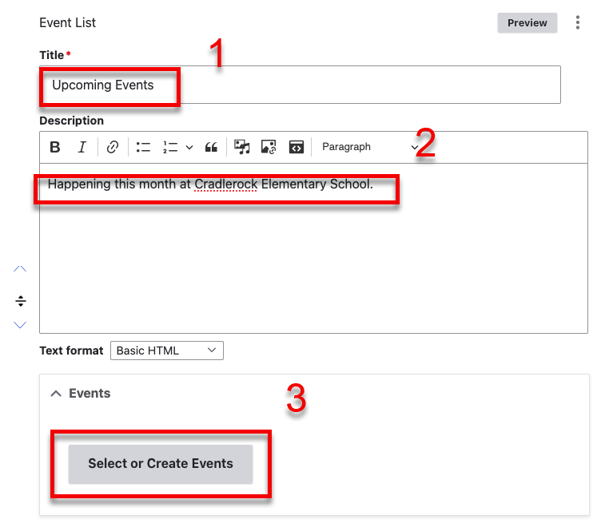

Then select the events you want to include and click *Select*.

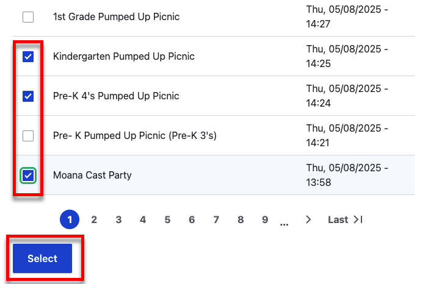

You can draq the events to reorder them:

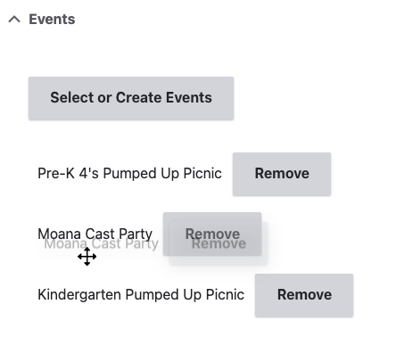

#### Rich Text

Select *Rich Text* and then click *Add Content Block*

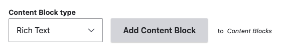

This gives you a Rich Content block where you can enter any text you would like.

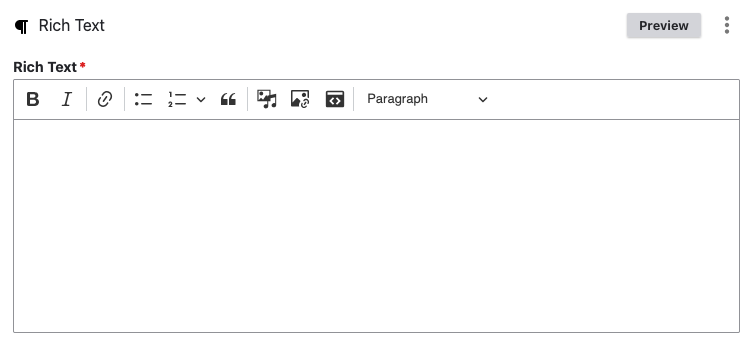

For more information on how to use the rich text editor see 
[Using the Rich Text Editor](using-the-rich-text-editor.md).

#### Community Events

Select *Community Event* and then click *Add Content Block*

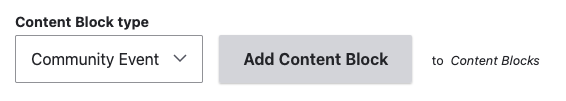

Then click *Select Community Event*

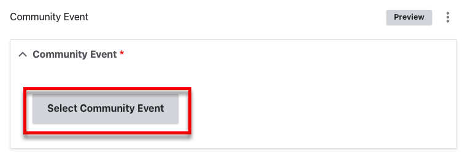

Then select the news item you want to include and click *Select*.

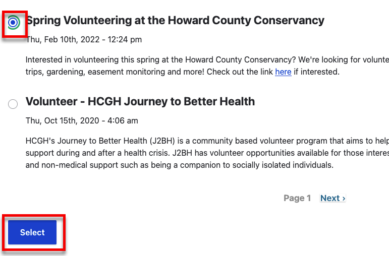

If you want to preview the community event, click *preview*.

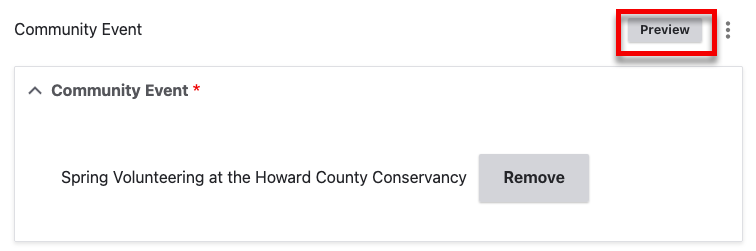

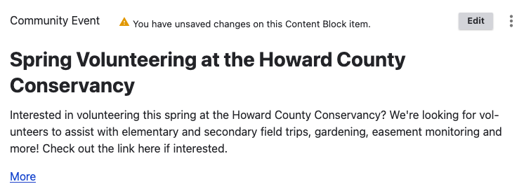

#### District News

Select *District News* and then click *Add Content Block*

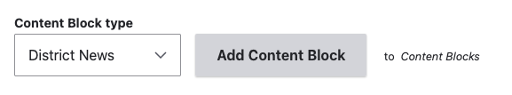

Then click *Select News Item*

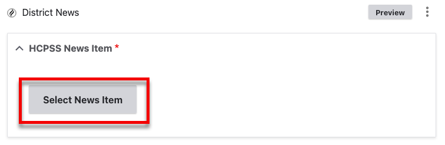

Then select an item and click *Select*

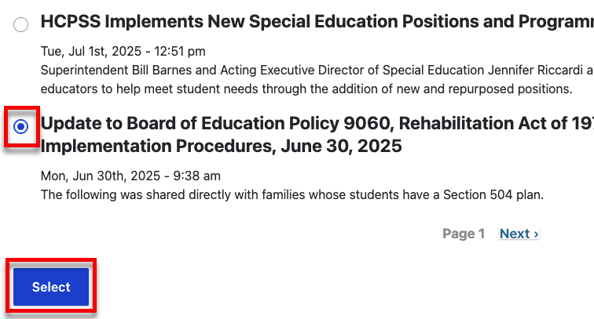

If you want to preview the district news, click *preview*.

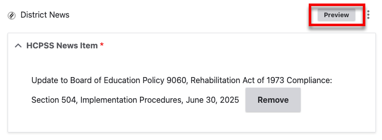

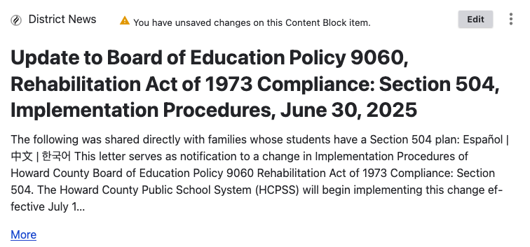

#### Other School News

Select *Other School News* and then click *Add Content Block*

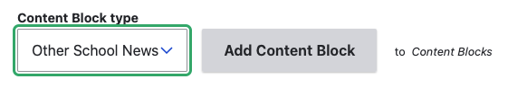

Then click *select*.

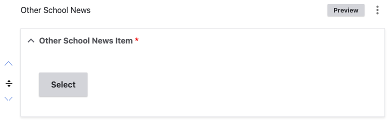

Then select the school.

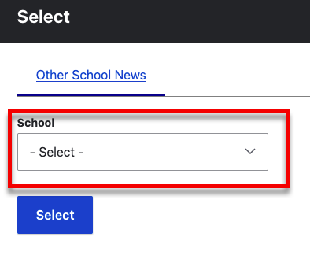

This will bring up a list of news items on that school website. Select one and
click *Select*.

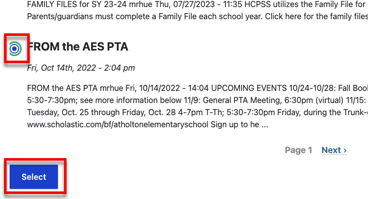

If you want to preview the news item, click *preview*.

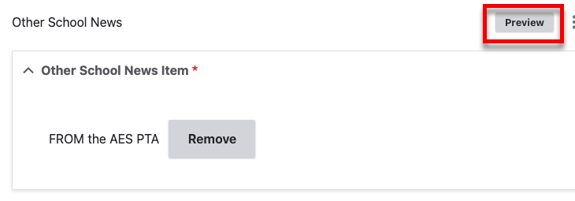

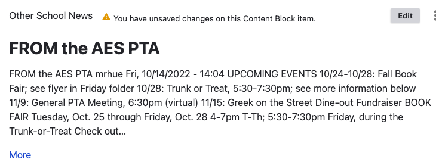

### Reordering Content Blocks

Reordering content blocks on the newsletter is identical to reordering content 
blocks on Advanced Pages so [please see that section for more 
information](advanced-pages.md#reordering-content-blocks).

### Saving a Newsletter

!!! question "Should Newsletters be Published?"
    Newsletters that are published are available to your website visitors. Published
    newsletters also show in your News list.
   
    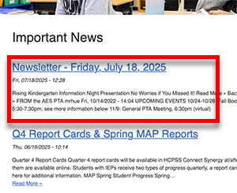
      
    The Newsletter builder is mainly meant to be a way for you to quickly build 
    newsletters that you send with SchoolMessenger. For that purpose, it is not 
    necessary to publish them. Unpublished newsletters can still be used to create
    SchoolMessenger messages but will not show up to your website visitors.
   
    Both publishing newsletter and leaving them unpublished is fine.

Once you are done adding content blocks, click *Save*

## Copying Your Newsletter Into School Messenger

When viewing your newsletter click *Copy to Clipboard*

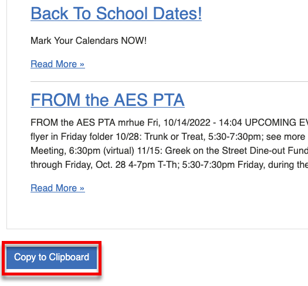

Then navigate to your draft news message in SchoolMessenger and past 
(with CTRL+v) in the body:

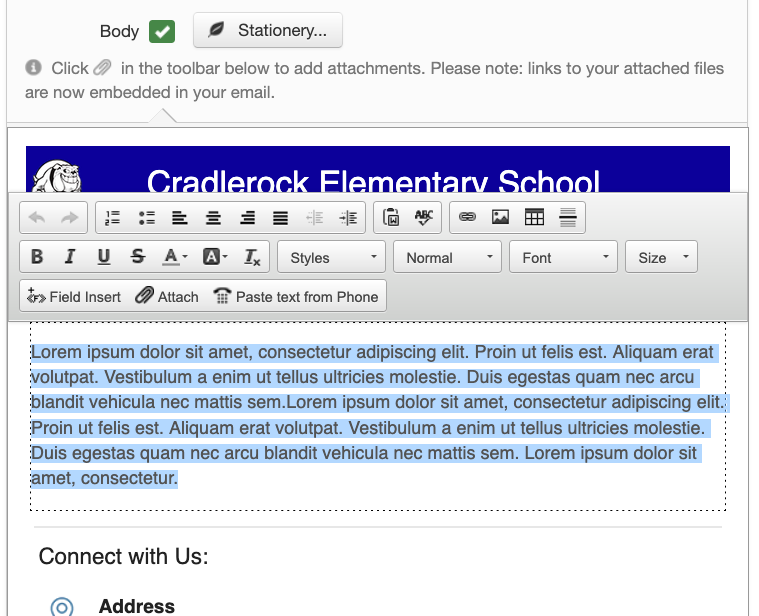

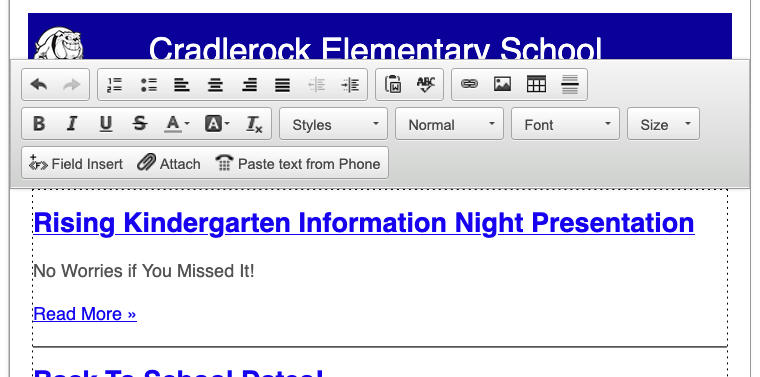
