# School Supply List

Your supply list should have already been created. You can find it in the *Quick Links* section of the dashboard:

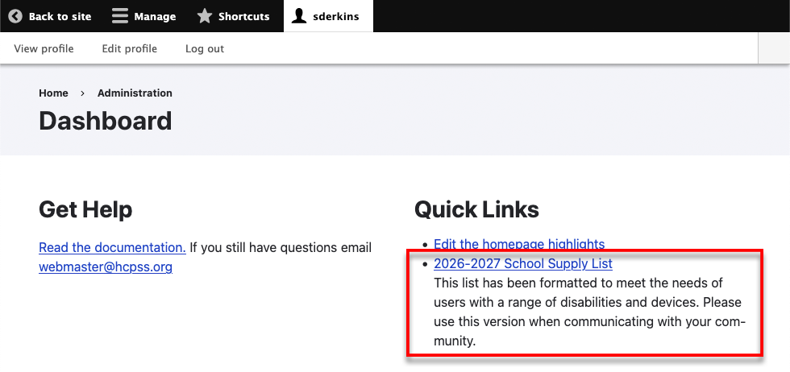

When you click on that link, you are taken to the supply list:

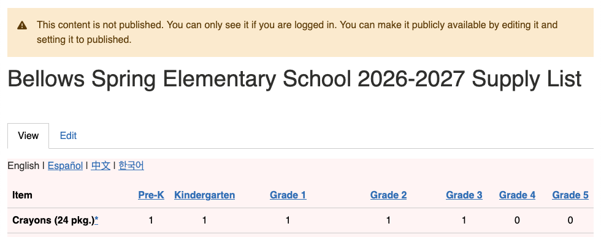

Notice that it is not published. This is indicated by the red background and warning message at the top. That means that you can view and edit it, but it will not be available to the public until you publish it.

## Editing the Supply List

Click *Edit*:

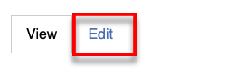

You will see a table of supply items:

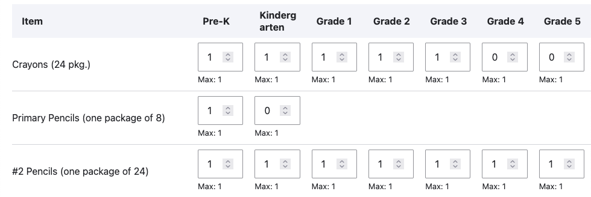

We have done our best to migrate data from the previous year.

Each item has a maximum quantity:

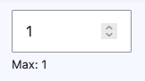

This maximum is set by the division of schools. Maximums are set to keep cost reasonable and lower the burden on families.

### Simple Quantities

Most of the input fields are simple fields that only allow you to enter a number.

### Complex Quantities

Some input fields have 3 dots next to them:

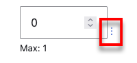

This indicates that there are some more advanced options. Different items have different options, but they might include:

- Colors
- Materials
- Contruction options

For example, if you click on the 3 dots next to *Pencil/Supply Box or Pencil/Supply Case*, you can see that you can set whether you want to specify a box or a zippered pouch:

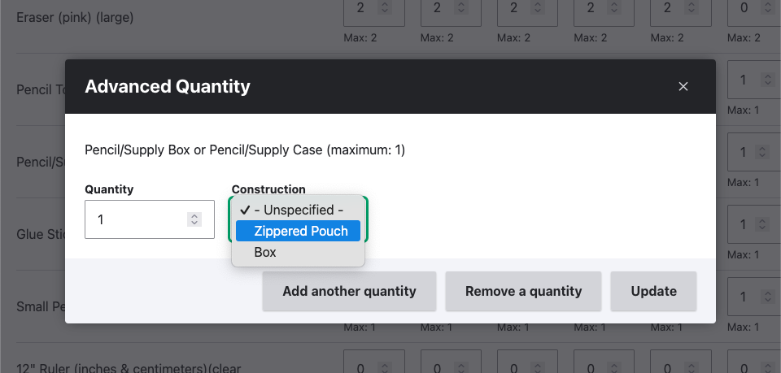

Some items allow more than one option. For example *Pocket Folders* allow you to specify colors, material, and whether the folders should have *prongs*:

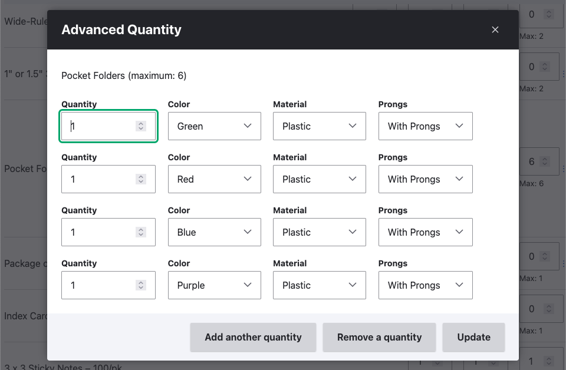

In this example, we already have 4 plasic folders with prongs specified. 1 green, 1 red, 1 blue, and 1 purple. If we wanted to add another color, we could click on *Add another quantity*:

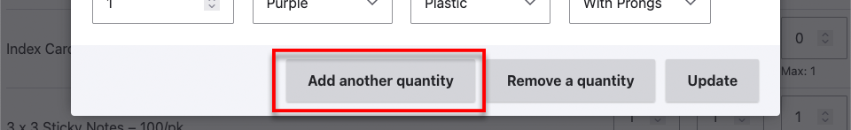

This will add another row:

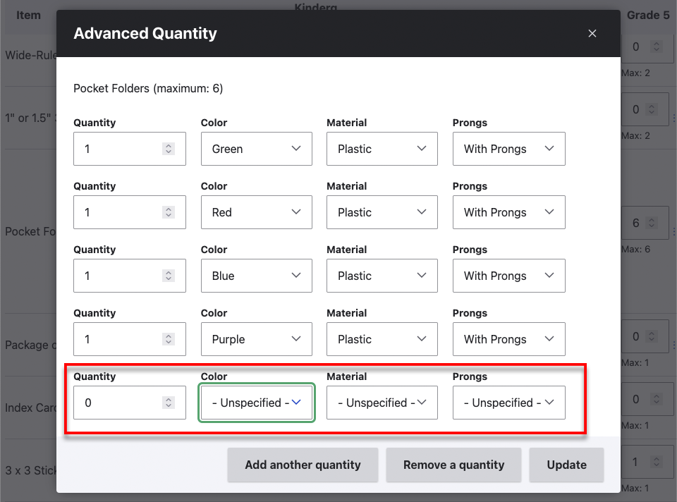

Where you can specify the color, material, and prong options:

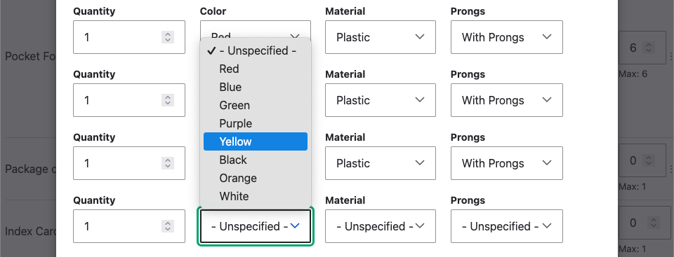

You can remove a row, by clicking the *Remove a quantity* button:

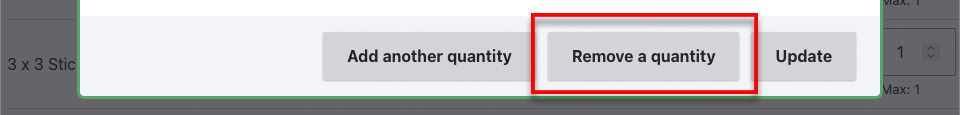

When you are done, click *Update*:

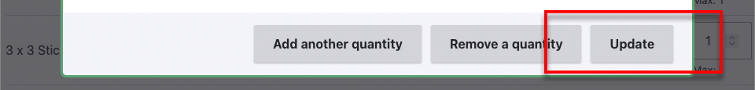

You should now see the summary of the quantities:

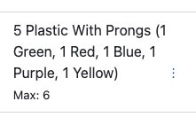

You can edit it again, by click on the 3 dots:

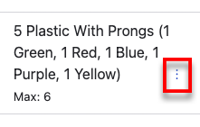

### Save your progress

You can save your progress at any time, by clicking *Save* at the bottom:

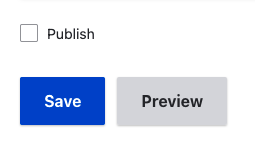

## Publishing

When you are ready to publish the supply lists just check the *Publish* checkbox and click *Save*:

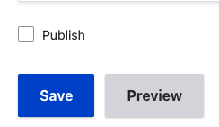

## Add Your Supply List to the Homepage

Go to your Dashboard and click *Edit the homepage highlights*:

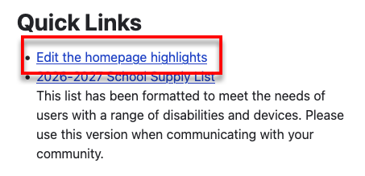

Click *Add*:

The *Find Supply List*:

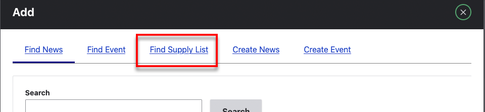

Click the checkbox next to the supply list and then click *Select*:

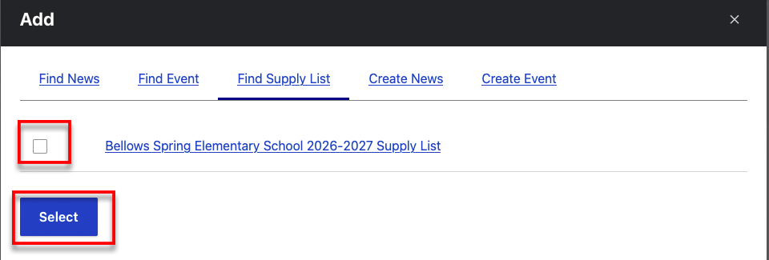

See the [Homepage Highlights](managing-homepage-highlights.md) page for more information about Homepage Highlights.
