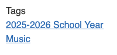
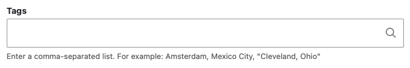
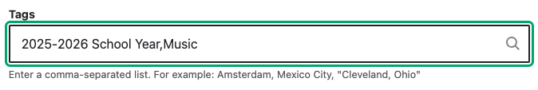
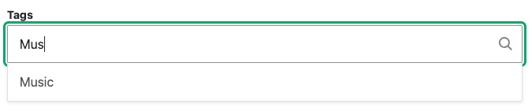

# Tagging Content

## Why Create Tags?

Tags group content together. They help users find related content. When a news
item or event is tagged, the tag shows up as a link on the page:

Clicking on the *Music* link will take you to a page with all the news and
events tagged with *Music*.

!!! tip

    Imagine tagging
    several news items and events with "Getting Ready for the 2025-2026 School Year"
    and then sending a link to that page in your newsletter or social media post.
    Your community members will have one page where they can find everything they
    need to prepare for the new school year.

## Creating Tags

[News Items](creating-and-editing-news-messages.md) and
[Events can](creating-and-editing-news-messages.md) be "tagged" using the "Tags"
form field:

Enter terms you would like to tag the content with seperated by commas:

As you type, the field will be autocompleted with existing tags:

If there is no existing tag, a new one will be created.
