# Using the Rich Text Editor

Many fields and content types on your website use the *Rich Text Editor*. You
may also hear the rich text editor refered to as a WYSIWYG, which is an acronym
for **W**hat **Y**ou **S**ee **I**s **W**hat **Y**ou **G**et, and is pronounced
*WIZ-ee-wig*.

You'll know you are dealing with the rich text editor when you see this toolbar.

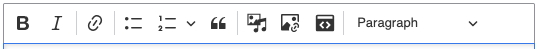

## The Toolbar

### Inline Format

The first 2 buttons are used to make text bold or itallic (B for bold, I for
itallics).

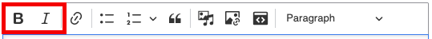

!!! tip "Make Your Text Easy to Scan"

    Bold and italics is great for calling attention to specific words or
    importand phrases, but if overused they can defeat that purpose. Entire
    sentences or paragraphs should not be bold or italicized.

    If everything is bold, then nothing is bold.

To use these buttons, first highlight the text and then click on the B or I
button.

### Hyperlinks

The next button is the hyperlink button.

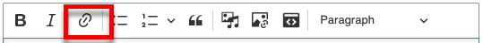

Similar to the inline format buttons, to create a hyperlink, first highlight the
text and then click the button. Then type or paste the URL (it should start with
*https://*). Finally, click the green checkmark.

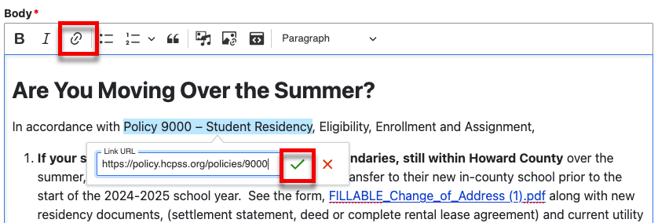

!!! tip "Make Your Hyperlinks Meaningfull"

    Ensure link text is meaningful and descriptive, indicating the purpose or
    destination of the link. **Avoid using vague terms like "click here" or
    "read more."** Example: Use "Download the annual report" instead of
    "Click here."

### Lists

The next two buttons are for making ordered and unordered lists.

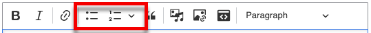

To create a list, place your cursor inside a block of text and click the desired
list button.

You can nest lists by placing your curser in a list item and pressing the *Tab*
key on your keybord.

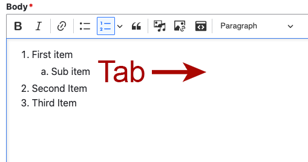

Remove nesting by pressing *Ctrl + Tab*.

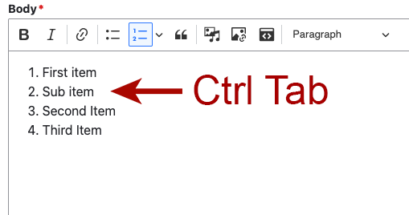

!!! tip "Tip"

    The rich text editor with try to automatically detect lists as you write.
    For example, if you type "1." and then press the spacebar, an ordered list
    will automatically be created. "-" and spacebar start an unordered list.

#### Make Sure Your Lists are Legitamate

Lists add structure to your content. This **structure is important for aiding
accessibility and general usability**. If you paste content from another source,
it is possible that you may have some items that look like lists but are not.

You can tell if your list is legitamate by placing the curser on one of the
items. Then look at the list buttons in the toolbar. If the list is legitamate,
one of the list buttons will be activated.

!!! example "Example of an illigitimate list"

    === "Rich text"

        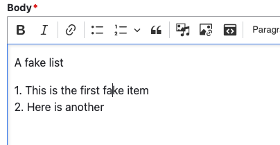

    === "Generated markup"

        ```html
            <p>
                1. This is the first fake item<br>
                2. Here is another
            </p>
        ```

!!! example "Example of a ligitimate list"

    === "Rich text"

        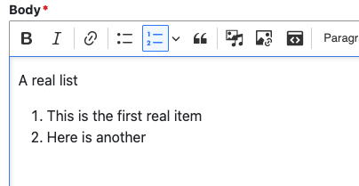

        Notice the active list button

    === "Generated markup"

        ```html
        <ol>
            <li>Ordered list item 1</li>
            <li>Ordered list item 2</li>
        </ol>
        ```

### Blockquote

!!! failure "Blockquote is Unused"

    Blockquote is not used and will be removed in the future.

### Insert Media

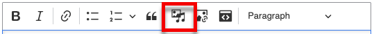

Use the *Insert Media* button to insert images and documents

For more information about inserting set the [manage media](adding-and-managing-media.md) section.

### Insert Image

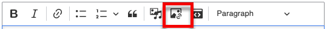

!!! failure "Insert Image is Depricated"

    The *Insert Image* button is there for backwards compatibility. You should not
    use it and it will be removed at some point.

### iFrame

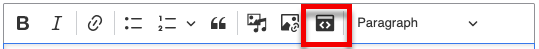

!!! failure "Insert Image is Depricated"

    The *iFrame* button is there for backwards compatibility. You should not
    use it and it will be removed at some point.

### Heading Level

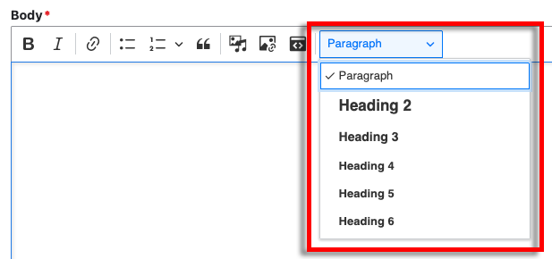

Headings are a critical part of writing content that is easy to read. They also
provide structure for the document that is used by screen readers and other
assistive technology, as well as search engines. So, consider breaking your
content into sections using headings.

!!! note "Why is Heading 1 Missing From the List?"

    Every webpage should have a single heading 1 and it is being used by the page
    title, so it is not possible to add one here in the content.

#### Usage

Think of your headings as creating an outline for your document.

```
Heading 1: Page title
Heading 2: Summary
Paragraph: Some text here...

Heading 2: Examples
Heading 3: Example 1
Paragraph: Some text here...

Heading 3: Example 2
Paragraph: Some text here...

Heading 2: See also
Paragraph: Some text here...
```

Would be equivelant to an outline like this:

1. Page title
    1. Summary
        1. Some text here...
    2. Examples
        1. Example 1
            1. Some text here...
        2. Example 2
            1. Some text here...
    3. See also
        1. Some text here...


!!! accessibility

    A common navigation technique for users of screen reading software is to
    quickly jump from heading to heading in order to determine the content of
    the page. Because of this, it is important to not skip one or more heading
    levels. Doing so may create confusion, as the person navigating this way may
    be left wondering where the missing heading is.

#### Notes

- Do not use heading elements to resize text.
- Do not skip heading levels: always start from `<h2>`, followed by `<h3>` and
  so on.

## Pasting from Other Sources

You can obviously type directly into the Rich Text Editor, but you will probably
often need to paste text from other documents.

When you copy something from a document, the text very often comes with hidden
formatting data. Having this data in a webpage can cause problems with the page
not displaying the text properly or formatting being completely broken.

### Pasting as Plain Text

The best was to get rid of the hidden formatting data is to paste the text into
a program that only supports plain text. There are alot of programs that can do
this, but 2 that you probably already have installed are Notepad for Windows and
TextEdit for MacOS.

Notepad is a plain text only program, but for TextEdit, you need to make sure it
is in plain text mode:

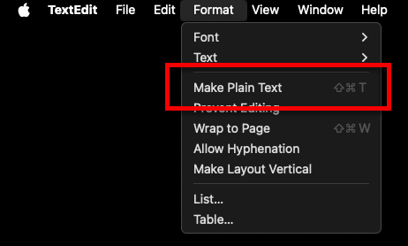

To paste as plain text.

1. Copy the text from the source
1. Paste the text into the program
2. Select the text
3. Copy the text from the program
4. Paste the text into the Rich Text Editor

All formating will be removed from the text so make sure you go back through and
add your headers, links, lists and other formatting.

### Pasting Directly from Microsoft Word or a Google Document

The Rich Text Editor tries it's best to remove any hidden formatting from
Microsoft Word and Google Documents. So, it is possible to paste directly from
one of these into the Rich Text Editor.

!!! warning

    You should carefully inspect your text after pasting it. Check for
    [illigitimate lists](#make-sure-your-lists-are-legitamate) and make sure
    your headings still make sense.
